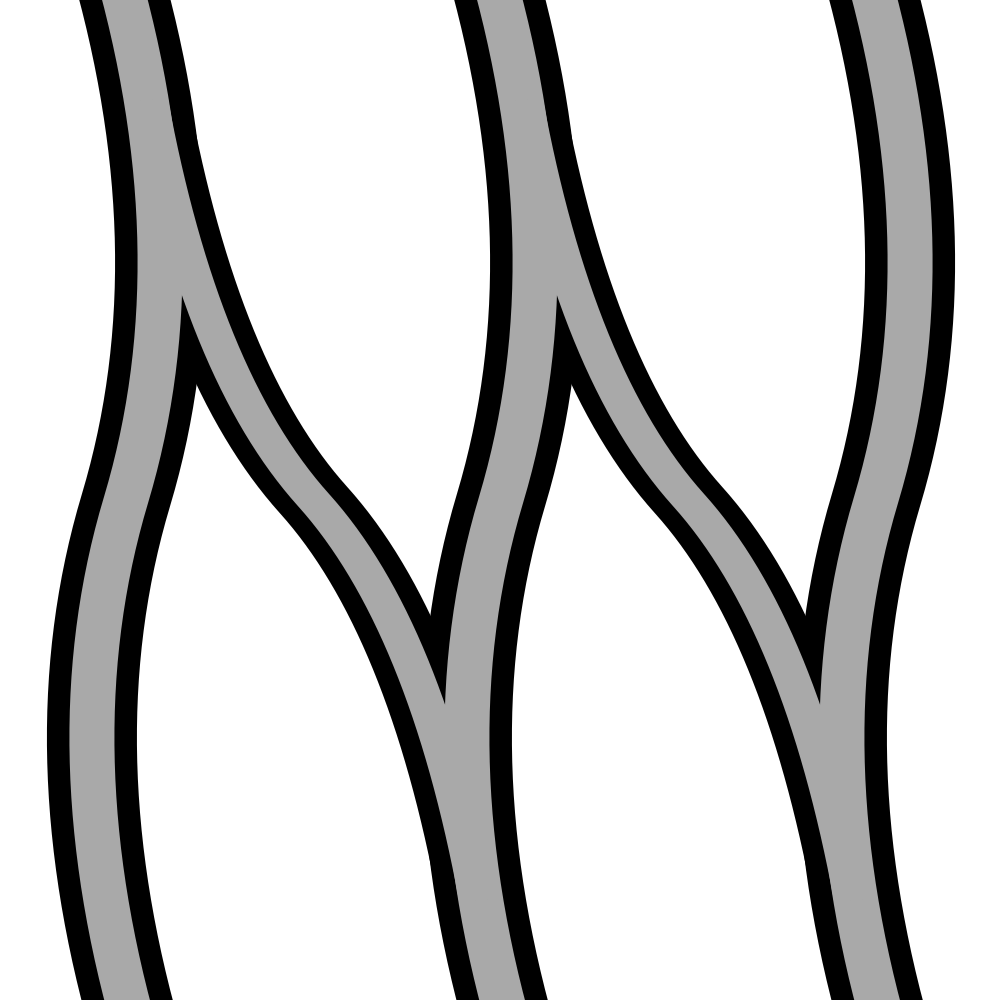
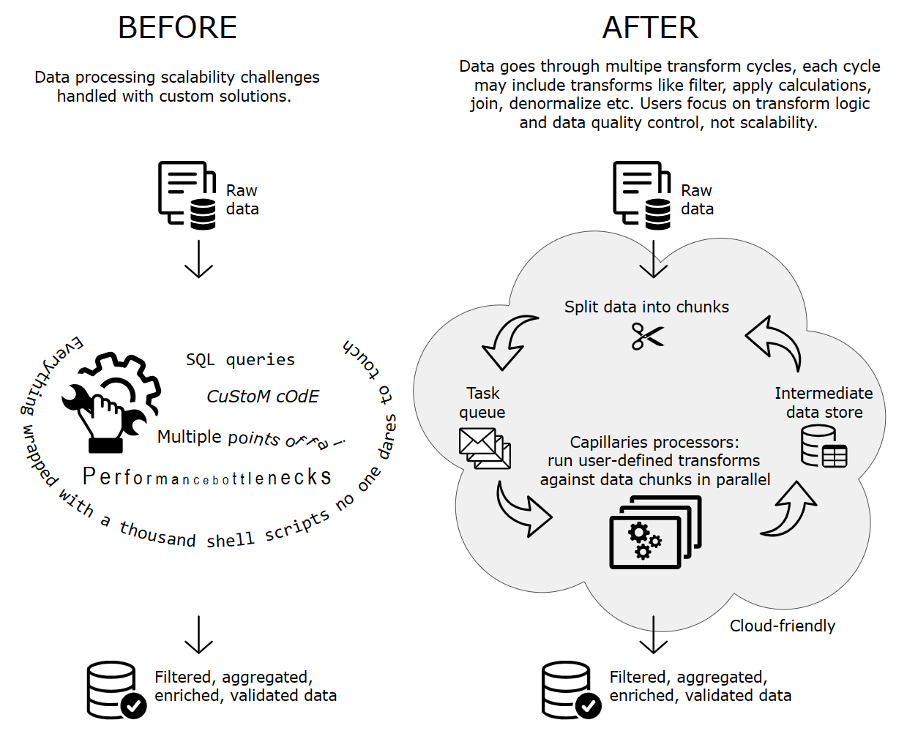

# Capillaries

Capillaries is a supervised data processing framework. It fills the gap between distributed, scalable data processing/integration solutions and the need to produce enriched, customer-ready, production-quality, human-curated data within SLA time limits.

## TL;DR

[What Capillaries is and what it is not, with a use case discussion and diagrams](doc/what.md)

[Getting started guide with instructions on how to run a quick Docker-based demo without building any code](doc/started.md)

## Why Capillaries?

|             | BEFORE | AFTER |
| ----------- | ------ |------ |
| Data aggregation | SQL joins | Capillaries [lookups](doc/glossary.md#lookup) in Cassandra + [Go expressions](doc/glossary.md#go-expressions) (scalability, parallel execution) |
| Data filtering | SQL queries, custom code | [Go expressions](doc/glossary.md#go-expressions) (scalability, maintainability) |
| Data transform | SQL expressions, custom code | [Go expressions](doc/glossary.md#go-expressions), Python [formulas](doc/glossary.md#py_calc-processor) (parallel execution, maintainability) |
| Intermediate data storage | Files, relational databases | on-the-fly-created Cassandra [keyspaces](doc/glossary.md#keyspace) and [tables](doc/glossary.md#table) (scalability, maintainability) |
| Workflow execution | Shell scripts, custom code, workflow frameworks | RabbitMQ as the Single Point of Failure + workflow status stored in Cassandra (parallel execution, fault tolerance, incremental computing) |
| Workflow monitoring and interaction | Custom solutions | Capillaries [UI](ui/README.md) and [Toolbelt](doc/glossary.md#toolbelt) utility (transparency, operator validation support) |
| Workflow management | Shell scripts, custom code | Capillaries [script file](doc/glossary.md#script) with [DAG](doc/glossary.md#dag) |

## Highlights

### Incremental computing

Allows splitting the whole data processing pipeline into separate runs that can be started independently and re-run if needed.

### Parallel processing

Splits large data volumes into smaller batches processed in parallel. Executes multiple data processing tasks ([DAG](doc/glossary.md#dag) nodes) in parallel.

### Operator interaction

Allows human data validation for selected data processing stages.

### Fault tolerance

Survives most of the temporary underlying database connectivity issues and processing node software and hardware failures.

### Works with structured data artifacts

Consumes and produces delimited text files, uses database tables internally. Provides ETL/ELT capabilities. Implements a subset of the relational algebra.

### Use scenarios

Capable of processing large amounts of data within SLA time limits, efficiently utilizing powerful computational (hardware, VM, containers) and storage (Cassandra) resources, with or without human monitoring/validation/intervention.

## Capillaries in depth

### [What it is and what it is not](doc/what.md)
### [Getting started](doc/started.md)
### [Testing](doc/testing.md)
### [Toolbelt, Daemon, and Webapi configuration](doc/binconfig.md)
### [Script configuration](doc/scriptconfig.md)
### [Capillaries UI](ui/README.md)
### [Capillaries API](doc/api.md)
### [Capillaries deploy tool: Openstack cloud deployment](test/deploy/README.md)
### [Glossary](doc/glossary.md)
### [Q & A](doc/qna.md)
### [MIT License](LICENSE)

(C) 2023 kleines.hertz[at]protonmail.com