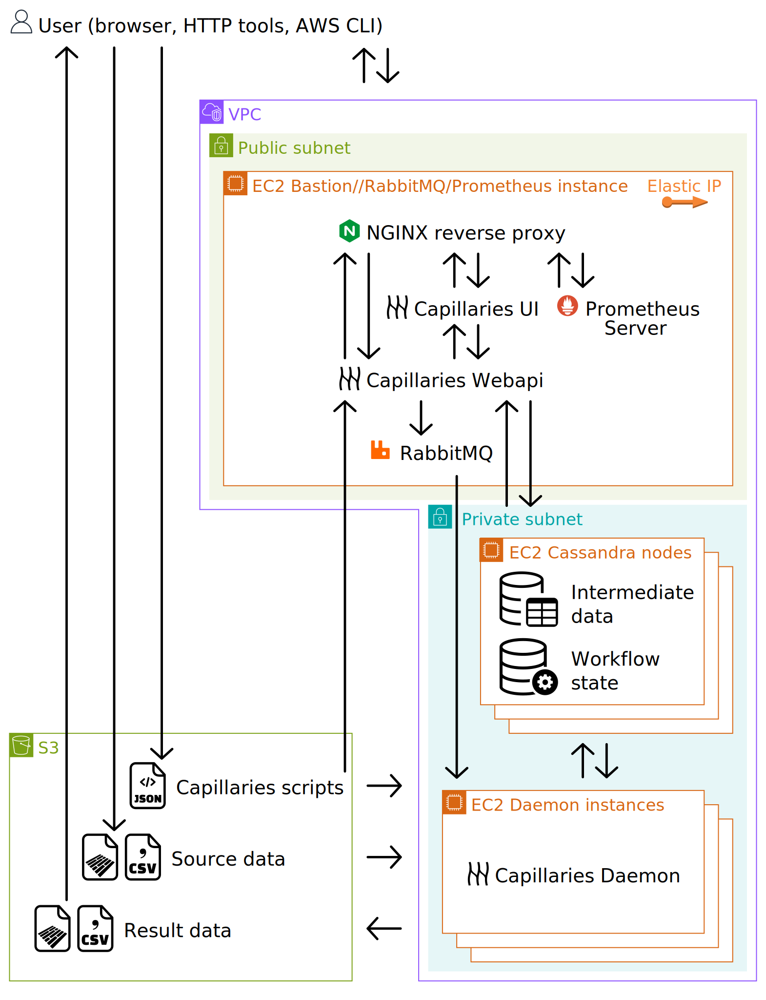

This is a sample Terraform AWS deployment for Capillaries

# Prerequisites

## AWS account

You will need an AWS account that is capable of creating Capillaries infractructure: vpc, subnets, instances etc. For non-prod environments, for the sake of simplicity (this is an example, remember) an AWS root account is ok.

## AWS region and availability zone

Just pick a region for your AWS resource (this example uses `us-east-1`) and availability zone for your subnets (this example uses `us-east-1a`).

TF variables: `awsregion`, `awsavailabilityzone`

## SSH keypair

This keypair will be used to access Capillaries instances via SSH.

TF variables: `ssh_keypair_name`

## S3 bucket

Make sure you have an S3 bucket as explained [Capillaries S3 doc](../../../doc/s3.md). Most likely, you will need to set up a user [UserAccessCapillariesTestbucket](../../../doc/s3.md#iam-user-useraccesscapillariestestbucket), otherwise you will not be able to upload source data and configuration files to the bucket from your devops machine. Make sure this user has full access to the bucket as the doc says.

EC2 instances of this deployment do NOT need UserAccessCapillariesTestbucket credentials, the instances use AssumeRole mechanism to access S3 bucket.

This example writes [Webapi](../../../doc/glossary.md#webapi) and [Daemon](../../../doc/glossary.md#daemon) log files to the `log` directory in your bucket.

TF variables: `s3_log_url`

## IP whitelist

This example does not create any complex security mechanisms besides IP whitelisting implemented by nginx web server running on the bastion instance. Collect all IP addresses (or subnets) from which you want to access Capillaries deployment as a comma-separated list, for example: 123.234.0.0/16,111.222.0.5

TF variables: `TF_VAR_BASTION_ALLOWED_IPS`

## Environment variables

Sensitive TF variables can be set from environment variables as follows:

```
export TF_VAR_BASTION_ALLOWED_IPS="123.234.0.0/16,111.222.0.5"
```

# Working with Capillaries deployment

After successfully running `terraform apply`, you will have a vpc with:
- a bastion/jumphost instance with Capillaries UI and Capillaries WebAPI, and nginx running as reverse proxy for them 
- a few EC2 instances running Capillaries Daemon



[This animation](https://capillaries.io/i/capi-animation.svg) explains how data flows between components in detail.

Store the bastion/jumphost address returned by Terraform in this environment variable:
 ```
export BASTION_IP=your_bastion_ip_address
```
 
To access the bastion instance, use:
```
ssh -o StrictHostKeyChecking=no -i ~/.ssh/your_keypair_private_key ubuntu@$BASTION_IP
```

To access daemon instances, set up a jumphost in ~/.ssh/config as:
```
Host your_bastion_ip_address
  User ubuntu
  StrictHostKeyChecking=no
  UserKnownHostsFile=/dev/null
  IdentityFile  /home/johndoe/.ssh/your_keypair_private_key
```

and access them using this command (daemon instance IP addresses end with 101, 102, 103 and so on):
```
ssh -o StrictHostKeyChecking=no -i ~/.ssh/your_keypair_private_key -J $BASTION_IP ubuntu@10.5.0.101
```

To run a simple lookup test, use:
```
cd test/code/lookup/quicktest_s3

# We store data and script here
export CAPILLARIES_AWS_TESTBUCKET=capillaries-testbucket

# We need it to call WebAPI
export BASTION_IP=your_bastion_ip_address
export EXTERNAL_WEBAPI_PORT=6544

# Remember UserAccessCapillariesTestbucket introduced in ../../../doc/s3.md ?
source ~/UserAccessCapillariesTestbucket.rc

# This creates source data and copies it together with lookup_quicktest script to the S3 bucket
./1_create_data.sh

# This calls WebAPI on the bastion instance to start the script, and waits until it's complete
./2_one_run_cloud.sh

# This downloads result data files from S3 bucket and compares them to the golden copy
./3_compare_results.sh

# This removes lookup_quicktest data and script from S3 bucket, and drops the keyspace with all data
./4_clean_cloud.sh
```

To watch the script running in the UI, visit `http://your_bastion_ip_address`.

Prometheus CPU and Cassandra writes at:
`http://$BASTION_IP$:9091/query?g0.expr=100+-+%28avg+by%28instance%29+%28rate%28node_cpu_seconds_total%7Bmode%3D%22idle%22%7D%5B1m%5D%29%29+*+100%29&g0.show_tree=0&g0.tab=graph&g0.range_input=15m&g0.res_type=auto&g0.res_density=medium&g0.display_mode=lines&g0.show_exemplars=0&g1.expr=sum%28irate%28cassandra_clientrequest_localrequests_count%7Bclientrequest%3D%22Write%22%7D%5B1m%5D%29%29&g1.show_tree=0&g1.tab=graph&g1.range_input=15m&g1.res_type=auto&g1.res_density=medium&g1.display_mode=lines&g1.show_exemplars=0`

To see the logs, download them from `s3://$CAPILLARIES_AWS_TESTBUCKET/log`, or use 

```
./download_logs.sh
```

# Deleting Capillaries deployment

Nothing beyond running `terraform destroy`.


