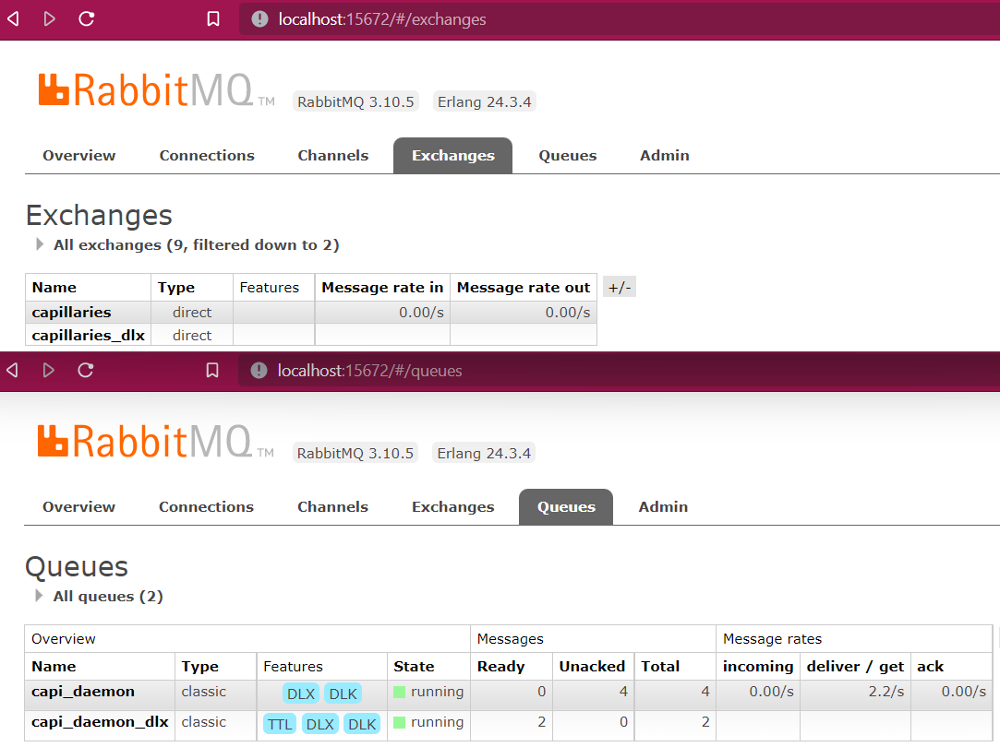

# Glossary

## Keyspace
Cassandra keyspace name. Capillaries uses keyspaces as part of a [script](#script) execution context. For example, if a [script](#script) is expected to be executed every hour, producing time-of-day-specific data, corresponding keyspaces may be "hourly_summary_2000_05_25_09_00", "hourly_summary_2000_05_25_10_00" and so on. Each keyspace will hold isolated data, index, and workflow [tables](#table).

Capillaries creates keyspaces on-the-fly when they are referenced for the first time.


## Supported types

Capillaries [scripts](#script) allow the following types:

### string
Golang string, Cassandra TEXT
### int
Golang int64, Cassandra BIGINT
### float
Golang float64, Cassandra DOUBLE
### bool
Golang bool, Cassandra BOOLEAN
### datetime
Golang time.time, Cassandra TIMESTAMP
### decimal2
Golang github.com/shopspring/decimal, Cassandra DECIMAL (both trimmed to 2 decimal digits)

## Run
Execution of a subset (or all) of [script](#script) [nodes](#script-node). Runs help cover the scenario with supervised script execution when an operator may want to wait for some nodes to complete, check result data quality, and initiate the next run that will use those validated results. Runs are numbered starting from 1.

## Data batch
1. Subset of rows from the source data [table](#table)
2. All data lines from one source data file read by [file-table processor](#file_table)  

## Parallelism
Ability of a [script node](#script-node) to split input data into [batches](#data-batch) and perform data processing simultaneously for multiple batches using multiple instances of the [daemon](#daemon). See [expected_batches_total](scriptconfig.md#rexpected_batches_total) setting.

## Script
Complete set of instructions on how to process data using Capillaries for a specific business task. On the top level, it's a map of [script nodes](#script-node) and a map of [dependency policies](scriptconfig.md#dependency_policies).

## Script node
A logical step in the [script](#script) that calls a specific [processor](#processor) and supplies it with data produced by other script nodes or by external components (for example, via files).

Nodes that allow [parallellism](#parallelism) eventually trigger multiple instances of [processors](#processor) on multiple machines.

## Join operations
SQL-style joins. Only two types of joins are supported:
- left: SQL LEFT OUTER JOIN
- inner: SQL INNER JOIN

Used by table_lookup_table [script nodes](#script-node)

## Table
Cassandra tables. There are three types of tables used by Capillaries. [Cassandra setup](#cassandra-setup) section has a cqlsh screenshot with all types of tables on it.

### Data table
Holds data results of a table-creating [node](#script-node). Data tables cannot have names that start with `idx_` or `wf_`.

### Index table
Holds index built as the result of a table-creating [node](#script-node). One [data table](#data-table) can have zero or many indexes, each defined using [index definition](#index-definition). Marked with `idx_` prefix. 

### Workflow table
Holds information about the execution status of each [batch](#data-batch), [node](#script-node), [run](#run) in this [keyspace](#keyspace). Marked with `wf_` prefix. 

Data/index tables are run-specific, so table names are suffixed with a correspondent [run](#run) id.

## Processor
Capillaries code that reads source data from source tables/files performs data processing and writes data to target [data tables](#data-table) or files.

## Processor types
The following processor types are supported out-of-the-box

### file_table
Reads data from the source data file and writes processed data to the target [table](#table)

### table_table
Reads data from the source [table](#table) and writes processed data to the target [table](#table)

### table_lookup_table
Reads data from the source [table](#table), finds matching rows in the lookup table, performs join operations, and writes processed data to a [table](#table)

### table_file
Reads data from the source [table](#table) and writes processed data to the target file

### table_custom_tfm_table
A custom processor that can be implemented by a third party. The following custom processors are part of this repository:
- [py_calc processor](#py_calc-processor)
- [tag_and_denormalize processor](#tag_and_denormalize-processor)

A custom processor must meet some requirements.

1. Must implement interfaces:
- CustomProcessorDef
- CustomProcessorRunner

2. When processing a source data row, it should not make any assumptions about other source or target data rows.

## py_calc processor
Sample [custom processor](#table_custom_tfm_table) implementation in [pkg/custom/py_calc](../pkg/custom/py_calc). Performs arbitrary data processing on input data using user-supplied Python formulas. The functionality is well-covered in [py_calc integration test](../test/code/py_calc/README.md).  [Toolbelt and Daemon environment configuration](binconfig.md) settings:

### python_interpreter_path
Full path to Python interpreter

### python_interpreter_params
Parameters passed to Python interpreter 

## tag_and_denormalize processor
Sample [custom processor](#table_custom_tfm_table) implementation in [pkg/custom/tag_and_denormalize](../pkg/custom/tag_and_denormalize). Denormalizes input data by checking tag criteria and producing a new data row for each matching tag. The functionality is well-covered in [tag_and_denormalize integration test](../test/code/tag_and_denormalize/README.md) and in the ["What it is"](what.md#sample-use) section.

[Toolbelt and Daemon environment configuration](binconfig.md) settings are discussed below.

### tag_field_name

The field in the target table where the tag value will be written to

### tag_criteria

tag->criteria_expression map. [Expressions](#go-expressions) are allowed to use reader fields only (`r.*`).

### tag_criteria_uri

Same as [tag_criteria](#tag_criteria), but in a separate JSON file. This is the preferred method to specify tag criteria because the list of tags:
- may contain thousands of entries, it's not a good idea to pollute the script file with those
- may be generated dynamically by some workflow component, it's good to have it contained in a single file without touching the script 

## Go expressions

One-line Go snippets used in [script](#script) settings: field expressions, writer "having" expressions, lookup "filter" expressions. For the list of supported operations, see `Eval(exp ast.Expr)` implementation in [eval_ctx.go](../pkg/eval/eval_ctx.go). For the list of supported Go functions, see `EvalFunc(callExp *ast.CallExpr, funcName string, args []interface{})` implementation in [eval_ctx.go](../pkg/eval/eval_ctx.go)

At the moment, Capillaries supports only a very limited subset of the standard Go library. Additions are welcome. Keep in mind that Capillaries expression engine:
- supports only primitive types (see [Capillaries data types](#supported-types))
- does not support class member function calls
- does not support statements or multi-line expressions

## Processor queue
RabbitMQ queue containing messages for a [processor](#processor). The name of the queue is given by the [handler_executable_type](binconfig.md#handler_executable_type) setting.

## DOT diagrams

[Graphviz DOT language](https://graphviz.org/) - markdown-style diagram-drawing language. There is a number of free online tools that can visualize DOT language documents.

## Toolbelt
A command-line executable that performs common Capillaries operations by:
- reading Capillaries [script files](#script)
- sending commands to the [processor queue](#processor-queue)

The Toolbelt:
- can [start/stop](api.md) [runs](#run), so solution developers can use it in their scripts
- gives very basic access to the [workflow tables](#workflow-table), see `get_*_history` commands
- can produce rudimentary visuals using [DOT diagram language](#dot-diagrams) - see `validate_script`, `get_run_status_diagram` commands

See [Toolbelt and Daemon configuration](binconfig.md) for configuration settings.

One of the main purposes of the toolbelt is to give system integrators easy access to [Capillaries API](api.md). Also, the toolbelt can be useful for visualizing [scripts](#script) and the status of their execution with [DOT diagrams](#dot-diagrams), for example:

```
# Can be executed anytime
go run capitoolbelt.go validate_script -script_file=../../../test/data/cfg/lookup_quicktest/script.json -params_file=../../../test/data/cfg/lookup_quicktest/script_params_two_runs.json -idx_dag=true

# Can be executed when the lookup script is running using two runs
go run capitoolbelt.go get_run_status_diagram -script_file=../../../test/data/cfg/lookup_quicktest/script.json -params_file=../../../test/data/cfg/lookup_quicktest/script_params_two_runs.json -keyspace=lookup_quicktest -run_id=1
```

## Deploy tool
capideploly is not part of Capillaries framework. It's a command line tool that can be used to deploy a complete Capillaries-based solution in the public or private cloud that implements Openstack API or in the AWS cloud. See [Capideploy repository](https://github.com/capillariesio/capideploy).

## Daemon
An executable that implements one or more [processors](#processor). Capillaries source code comes with a stock daemon that implements all supported [processor types](#processor-types), including [py_calc processor](#py_calc-processor) implemented as a [custom processor](#table_custom_tfm_table).

The daemon consumes all messages from the [processor queue](#processor-queue) specified by the [handler_executable_type](binconfig.md#handler_executable_type) setting.

After processing all batches for a [node](#script-node), the daemon sends batch messages to dependant nodes, using RabbitMQ exchange specified by 

For example, the stock daemon coming as part of the Capillaries source code uses:
- queue name ([handler_executable_type](binconfig.md#handler_executable_type)): "capi_daemon"
- exchange name ([exchange](#exchange)):"capillaries"
 
Third-party daemons may use other names for either/both queue and exchange, but in this case, the developers are in charge of creating all correspondent RabbitMQ infrastructure for that queue name, including [dead-letter-exchange](qna.md#dead-letter-exchange).

See [Toolbelt and Daemon configuration](binconfig.md) for configuration settings.

## Webapi

A simple application that provides web service access to Capillaries environment (similar to the [Toolbelt](#toolbelt), but it speaks HTTP instead of cmdline). Can be used by [Capillaries-UI](#capillaries-ui), by integration tests (see [lookup Webapi test](../test/code/lookup/README.md#webapi) or by third-party applications.

Please note that Webapi lacks user authorization capabilities. 

## Capillaries-UI

A simple web UI application that provides user access to Capillaries environment (RabbitMQ queues and Cassandra storage) using [Webapi](#webapi). See [Capillaries-UI readme](../ui/README.md) for details.

## DAG

[Directed Acyclic Graph](https://en.wikipedia.org/wiki/Directed_acyclic_graph). Used in workflow descriptions and defines a collection of all tasks to run, organized in a way that reflects their relationships and dependencies.

## Logger

Capillaries uses [zap by Uber](https://github.com/uber-go/zap) for logging. Logger settings can be changed in [environment config](./binconfig.md#toolbelt-daemon-and-webapi-configuration) JSON file. For log analysis, use free or commercial tools of your choice.

## rowid

Unique int64 identifier assigned by Capillaries to every data row. Used internally in data table [reader](scriptconfig.md#r---reader) and [lookup](#lookup) implementation.

## File reader column definition

Defines how file reader reads columns from the source file (CSV, Parquet).

### Generic file reader column properties

`col_default_value`: default value (specified as string in this setting: "0.0", "true" etc) to be used if the source file contains no value for this field; if omitted, the default Go value for this type is used

`col_type`: one of the [supported types](#supported-types)

### CSV reader column properties

`csv.col_idx`: zero-based column index in the source file; prohibited if col_hdr is specified

`csv.col_hdr`: source file column header; prohibited if col_idx is specified

`csv.col_format`: depends on the field type:
- `int`: must include `%d`, `fmt.Sscanf()` is used internally
- `float`: must include `%f`, `fmt.Sscanf()` is used internally
- `decimal2`: must include `%f`, `fmt.Sscanf()` is used internally
- `datetime`: must include Go `2006-01-02 15:04:05`-style format specifier, `time.Parse()` is used internally
- `string`: should not specify format, whole field contents will be loaded
- `bool`: should not specify format, `strconv.ParseBool` is used internally

### Parquet reader column properties

`parquet.col_name`: column name

Parquet types supported by Parquet Reader (from Parquet to Capillaries/Go):

| Parquet Type/Logical | Capillaries (Go) |
|---------|-------------|
| BYTE_ARRAY/UTF8 | string |
| INT_64, INT_32 | int64 |
| FLOAT, DOUBLE | float64 |
| BOOLEAN | bool |
| INT_32/DECIMAL, INT_64/DECIMAL, FIXED_LEN_BYTE_ARRAY/DECIMAL (up to 8 bytes only) | decimal2 |
| INT_96, INT_32/DATE, INT_32/TIMESTAMP(MILLIS,MICROS), INT_64/TIMESTAMP(MILLIS,MICROS) | datetime |

## Table writer field definition

Defines how table writer saves values to the target table.

`expression`: [Go expression](#go-expression), can use reader (`r.*`), lookup (`l.*`), and custom processor (`p.*`) fields

`type`: one of the [supported types](#supported-types)

`default_value`: default value (specified as string in this setting: "0.0", "true" etc) to be used if left outer [lookup](#lookup) produced no value on the right; if omitted, default Go value for this type is used

## File writer column definition

Defines how file writer saves values to the target file (CSV, Parquet).

### Generic file writer column properties

`name`: column name to be used in [having](#w.having)

`type`: one of the [supported types](#supported-types)

`expression`: [Go expression](#go-expression), can use reader fields only (`r.*`)

### CSV-specific writer column properties

`format`: Go format string to be used when writing a value as text to the file, depends on the column type:
- `int`: must include `%d`
- `float`: must include `%f`
- `decimal2`: must include `%s`
- `datetime`: must include Go `2006-01-02 15:04:05`-style format specifier
- `string`: must include `%s`
- `bool`: must include `%t`

`header`: column header to be used in the target file

### Parquet-specific writer column properties

`column_name`: column name

Parquet writer types:

| Capillaries (Go) | Parquet Type/Logical |
|----------------|---------|
| string | BYTE_ARRAY/UTF8 |
| int64 | INT_64 |
| float64 | DOUBLE |
| bool | BOOLEAN |
| decimal2 | INT_64/DECIMAL |
| datetime | INT_64/TIMESTAMP(MILLIS) |

## Index definition

Used in [w.indexes](#w.indexes). Syntax:

```
[unique|non_unique](order_expression)
```
where order_expression is an [order expression](#order-expression).

A unique index enforces key uniqueness on the database level. Key uniqueness does not affect lookup behaviour.

## Order expression
Used in [index definitions](#index-definition), [top.order](#w.top) and [dependency policy event_priority_order](#event_priority_order) settings. Syntax:
```
[<field_name>([case_modifier|sort_modifier,...]),...]
```
where
```
case_modifier: case_sensitive|ignore_case
sort_modifier: asc|desc
```

All index, sorting and dependency policy event_priority_order logic implemented by order expressions revolves around string keys built by `BuildKey()` in [key.go](../pkg/sc/key.go).

## Lookup

The mechanism for complementing a data row from the primary source table with matching data in the secondary (lookup) source table. Capillaries support two types of SQL-style lookups: inner and left outer (see [Join operations](#join-operations)).

## RabbitMQ setup

There is no need to perform any setup steps beyond specifying RabbitMQ [url](binconfig.md#url) in [Toolbelt and Daemon configuration](binconfig.md). [Toolbelt](#toolbelt) and [Daemon](#daemon) will create all required exchanges and queues on the fly. Below is a sample view of [RabbitMQ Management Plugin](https://www.rabbitmq.com/management.html) after Toolbelt/Daemon has successfully initialized RabbitMQ:



## Cassandra setup

There is no need to perform any setup steps beyond specifying [Cassandra connectivity settings](binconfig.md#cassandra) in [Toolbelt and Daemon configuration](binconfig.md). [Toolbelt](#toolbelt) and [Daemon](#daemon) will create [keyspaces](#keyspace) and [tables](#table) on the fly. Below is a sample cqlsh session after [lookup integration test](../test/code/lookup/README.md) completed 2 [runs](#run) by executing

```
cd ./test/code/lookup/quicktest
./1_create_data.sh
./2_two_runs.sh
```


All [data](#data-table), [index](#index-table) and [workflow](#workflow-table) tables are in place here.


## SFTP URIs

Capillaries supports reading source data and configuration files, and writing result data files via SFTP. SFTP URI format used is as follows:

`sftp://user@host[:port]/path/to/file`

where

`user`: name of the user on the targeted host; no user passwords authentication supported; only private key authentication supported, and the path to the private key is given by the [private_keys](./binconfig.md#private_keys) map: a `user` entry corresponds to a path to the private key.

`host`: target host name or IP address

`port`: optional, default is 22

`/path/to/file`: full absolute path to the file

Here is the full list of configuration settings where SFTP URIs can be used:
- [file reader source URIs](./scriptconfig.md#rurls)
- script_file and script_params URIs used in [Capillaries API](./api.md) and exposed via the [Toolbelt](./glossary.md#toolbelt) or the [Webapi](./glossary.md#webapi)
- [file writer target URIs](./scriptconfig.md#wurl_template)