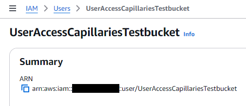
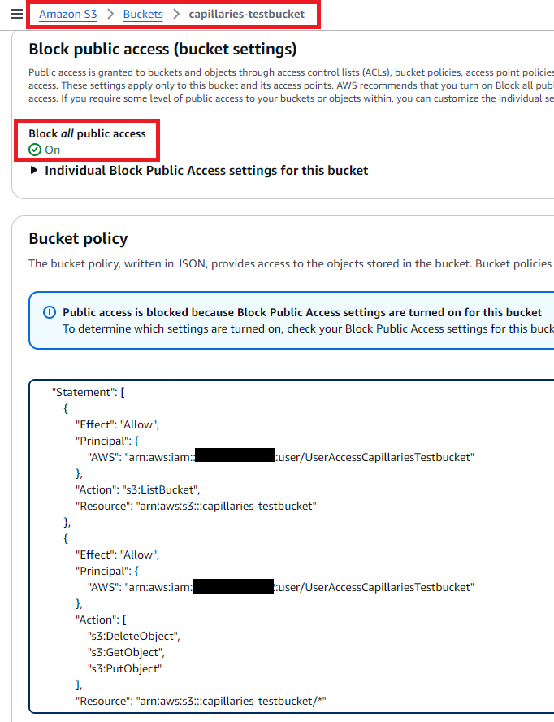

# S3 data access

[Integration tests suite](./testing.md#integration-tests) contains tests that use data and config files stored in AWS S3. [k8s POC](../test/k8s/README.md) also uses S3 files. You have to perform some AWS setup steps to make S3 integration tests and k8s POC work.

For demo purposes, Capillaries Docker-based and k8s POC test environments use user-based permissions (see below), which may not be the preferred way of controlling access in production AWS environment. Using role assumption approach is the recommended way and [capideploy SaaS scenario](https://github.com/capillariesio/capillaries-deploy/blob/main/README.md#iam-settings---saas-scenario) follows that approach.

## Bucket capillaries-testbucket

Create capillaries-testbucket (this name may be taken already, so you may be forced to use some other name, or you may want to run capillaries using your `acme-corp-prod-files` bucket). In `Amazon S3->Buckets->capillaries-testbucket->Permissions` tab, turn `Block all public access` on.

Before running tests, make sure you have this environment variable set:
```
export CAPILLARIES_AWS_TESTBUCKET=capillaries-testbucket
```

## IAM user UserAccessCapillariesTestbucket

daemon/webapi/toolbelt running in our Docker/k8s tests will this IAM user credentials and access `capillaries-testbucket`.

Create IAM user `UserAccessCapillariesTestbucket`.



No need to attach any security policy to this user (we will adjust S3 bucket permissions below so this user can access it).

Create access key for it, save it to ~/UserAccessCapillariesTestbucket.rc:
```
export AWS_ACCESS_KEY_ID=AK...
export AWS_SECRET_ACCESS_KEY=...
export AWS_DEFAULT_REGION=us-east-1
```

Now, everytime you run Capillaries test Docker setup (say, docker compose) or k8s POC, make sure you have those variables set:

```
source ~/UserAccessCapillariesTestbucket.rc
```

docker-compose.yml uses those environment variables when creating containers for daemons and webapi, and k8s POC setup creates secrets from them.

## Bucket permissions for UserAccessCapillariesTestbucket

In `Amazon S3->Buckets->capillaries-testbucket->Permissions->Bucket policy` specify:

```json
{
	"Version": "2012-10-17",
	"Statement": [
		{
			"Effect": "Allow",
			"Principal": {
				"AWS": "arn:aws:iam::<your_aws_acount>:user/UserAccessCapillariesTestbucket"
			},
			"Action": "s3:ListBucket",
			"Resource": "arn:aws:s3:::capillaries-testbucket"
		},
		{
			"Effect": "Allow",
			"Principal": {
				"AWS": "arn:aws:iam::<your_aws_acount>:user/UserAccessCapillariesTestbucket"
			},
			"Action": [
				"s3:DeleteObject",
				"s3:GetObject",
				"s3:PutObject"
			],
			"Resource": "arn:aws:s3:::capillaries-testbucket/*"
		}
	]
}
```


