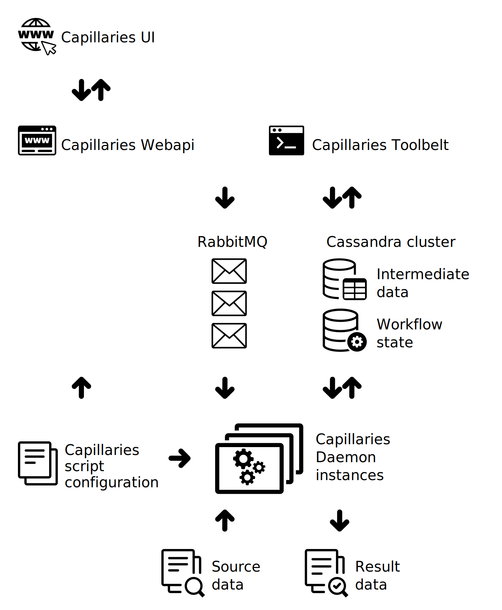

# Capillaries: what it is and what it is not

## What it is

Capillaries is a distributed data-processing framework that:
- works with structured row-based data
- splits data into batches that can be processed as separate jobs on multiple machines in parallel
- allows scenarios that involve human operator supervision and data validation
- has basic ETL/ELT capabilities
- has basic SQL-like join, grouping, and aggregation capabilities
- allows [custom data processing](glossary.md#table_custom_tfm_table) plugins
- requires basic knowledge of [Go](https://go.dev)

## Sample use

For example, this Capillaries [script](glossary.md#script) - [test/data/cfg/tag_and_denormalize/script.json](../test/data/cfg/tag_and_denormalize/script.json) - for the [tag_and_denormalize integration test](../test/code/tag_and_denormalize/README.md) can be described with this [DAG](glossary.md#DAG) diagram (open it the SVG in a separate browser window to see node tooltips, they may be helpful):

Workflow steps are discussed in detail below.

### Read source data into the table

Raw source data looks like this:
| product_id | product_name | product_category_tree | retail_price | product_specifications |
|----|----|----|----|----|
| 637356 | Breitling AB011010/BB08 131S Chronomat 44 Analog Watch - For Boys Men | Watches >> Wrist Watches >> Breitling Wrist Watches | 571230 | {"k":"Occasion","v":"Formal, Casual"}, {"k":"Ideal For","v":"Boys, Men"}, {"k":"Water Resistance Depth","v":"200 m"} |
| 825439 | Ambika Lahenga Embroidered Lehenga Choli and Dupatta Set | Clothing >> Women's Clothing >> Ethnic Wear >> Lehenga Cholis >> Lehengas >> Ambika Lahenga Lehengas >> Ambika Lahenga Embroidered Lehenga Choli and Du... | 39992 | {"k":"Fabric","v":"Net"}, {"k":"Ideal For","v":"Women's"}, {"k":"Occasion","v":"Party"} |

This step writes source data to the `products` table.

### Tag source data

This step denormalizes raw data by checking if the row matches some tag criteria and writing denormalized data to the `tagged_products` table.

Here are some of the criteria used (each criterion is a [GO expression](doc/../glossary.md#go-expressions)):

| tag | criteria_expression |
|----|----|
| engagement | re.MatchString(\`"k":"Occasion","v":"[\w ,]\*Engagement[\w ,]*"\`, r.product_spec) && re.MatchString(\`"k":"Gemstone","v":"Diamond"\`, r.product_spec) && r.price > 5000 |
| diving | re.MatchString(\`"k":"Water Resistance Depth","v":"(100\|200) m"\`, r.product_spec) |

Denormalized data looks like this (rows ordered by price):

| tag | product_id | price
|----|----|----|
| boys | 848735 | 571230.00 |
| boys | 174632 | 201000.00 |
| boys | 659038 | 107750.00 |
| diving | 502725 | 107750.00 |
| boys | 856325 | 49999.00 |
| engagement | 982547 | 49999.00 |
| engagement | 275735 | 49970.00 |

### Calculated totals by tag

This step groups tagged products and calculates aggregates:

| tag | total_value | avg_value | min_value | max_value | item_count|
|----|----|----|----|----|----|
| boys | 1345698.00 | 5850.86 | 200.00 | 571230.00 | 230 |
| casualfootwear | 1448884.00 | 1788.75 | 224.00 | 19995.00 | 810 |
| diving | 162995.00 | 6519.80 | 499.00 | 107750.00 | 25 |
| engagement | 15168839.00 | 35441.21 | 7193.00 | 49999.00 | 428 |

## Capillaries components

This is how deployed Capillaries components interact. For component definitions, see the [glossary](glossary.md).

## What it is not

1. This is not a generic job scheduler or workflow engine. Capillaries can only execute [nodes](glossary.md#script-node) in a [script](glossary.md#script), reading/writing data from/to [tables](glossary.md#table) or files.

2. This is not a generic data storage solution. Capillaries uses Cassandra as temporary storage for potentially very large amounts of data required for processing.

3. Implementing complete relational algebra is not the goal. Do not expect complex joins support.
   
## Key architecture points

1. Data/index/state table rows are immutable and all operations on them are idempotent. [Script](glossary.md#script) execution should survive temporary DB failures without any need for operator intervention. Data/index [table](glossary.md#table) rows can be deleted though during [batch re-runs](scriptconfig.md#rerun_policy) if needed.
   
2. Capillaries follows a Cassandra-style mindset: everything that prevents scalability should be prohibited or limited. For example, Capillaries has limited [data sorting](scriptconfig.md#w_top) capabilities.
   
3. Eventual data consistency is guaranteed by message queue (RabbitMQ): every message triggering [data batch](glossary.md#data-batch) processing will be delivered to the [processor](glossary.md#processor) as many times as needed. If message queue connectivity is unreliable, script execution consistency is not guaranteed. 

The following sequence diagram shows Cassandra components interaction in more detail:

