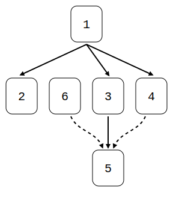
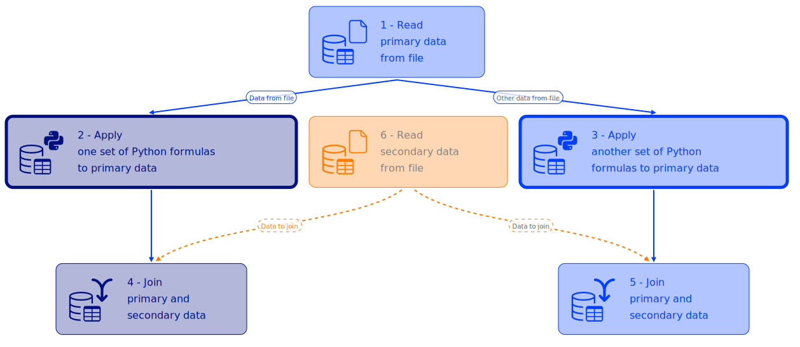
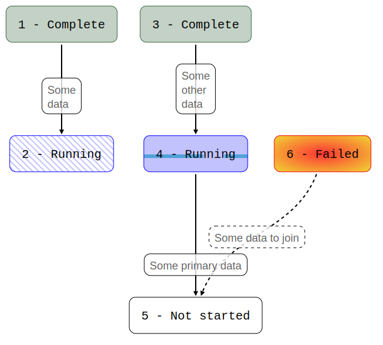

Capigraph is a Go library, it started as part of the [Capillaries](https://github.com/capillariesio/capillaries) project, now it's a spin-off.
It is pretty opinionated and it is used by Capillaries to draw process diagrams in Capillaries WebUI. It generates SVG diagrams from definitions in Go programs. It was designed to visualize a pretty specific class of diagrams, see details and examples below. If this is your kind of diagrams - congratulations, otherwise - sorry.

## Highlights and shortcomings

What it does:
- DAG only
- Each node can have zero or one incoming primary edge (solid arrows), and zero or more incoming secondary edges (dashed arrows)
- Nodes are arranged as if they are executed in stages, top to bottom

The good:
- Coloring by root node
- Thick border for selected nodes
- Multi-line text for nodes and edge labels
- User-defined node icons (SVG defs)
- User-defined node backgrounds (SVG defs - fill patterns)

The bad:
- Secondary edges can overlap with nodes and other edges (this is why nodes and edge labels are semi-transparent)
- Edge labels can overlap with each other (play with font size and node widths to mitigate this)

## Examples

### Basic monochrome diamond-shaped diagram

```
func TestReadmeMonochromeDiamond(t *testing.T) {
	var testNodeDefsDiamond = []NodeDef{
		{1, "1", EdgeDef{}, nil, "", 0,
		NodeBorderRegular, TextColorDefault, NodeBackgroundSolid, ""},
		{2, "2", EdgeDef{1, "", TextColorDefault}, nil, "", 0,
		NodeBorderRegular, TextColorDefault, NodeBackgroundSolid, ""},
		{3, "3", EdgeDef{1, "", TextColorDefault}, nil, "", 0,
		NodeBorderRegular, TextColorDefault, NodeBackgroundSolid, ""},
		{4, "4", EdgeDef{1, "", TextColorDefault}, nil, "", 0,
		NodeBorderRegular, TextColorDefault, NodeBackgroundSolid, ""},
		{5, "5", EdgeDef{3, "", TextColorDefault}, []EdgeDef{
			{4, "", TextColorDefault},
			{6, "", TextColorDefault}},
		"", 0,
		NodeBorderRegular, TextColorDefault, NodeBackgroundSolid, ""},
		{6, "6", EdgeDef{}, nil, "", 0,
		NodeBorderRegular, TextColorDefault, NodeBackgroundSolid, ""},
	}
	svg, _ := Draw(context.TODO(),
		testNodeDefsDiamond,
		DefaultNodeFontOptions(),
		DefaultEdgeLabelFontOptions(),
		DefaultEdgeOptions(),
		"", "", nil, Optimize)
	fmt.Printf("%s\n", svg)
}
```



### Nodes colored by root and icons

```
func TestReadmeRootColors(t *testing.T) {
	const defsToAdd = `
<g id="icon-database-table-read">
	<g transform="scale(0.56) translate(2,61)">
		<path fill-rule="evenodd"
		d="M16.49,24.88C24.05,27.41,34.57,29,46.26,29S68.48,27.41,76,24.88c6.63-2.22,10.73-4.9,10.73-7.52S82.67,12.06,76,9.84C68.48,7.33,58,5.75,46.27,5.75S24.06,7.33,16.49,9.84c-14.06,4.7-14.46,10.21,0,15ZM64.91,55.34h48.73a9.27,9.27,0,0,1,9.24,9.24v42.58a9.27,9.27,0,0,1-9.24,9.25H64.91a9.27,9.27,0,0,1-9.24-9.25V64.58a9.27,9.27,0,0,1,9.24-9.24ZM91.09,99.18H118v12H91.09v-12Zm-30.89,0H87.13v12H60.2v-12Zm0-31.89H87.13v12H60.2v-12Zm0,15.94H87.13v12H60.2v-12ZM91.09,67.29H118v12H91.09v-12Zm0,15.94H118v12H91.09v-12ZM5.82,45.77c.52,2.45,4.5,4.91,10.68,7,7.22,2.42,17.16,3.95,28.24,4.08v5.77c-11.67-.13-22.25-1.78-30.05-4.39A35.86,35.86,0,0,1,5.84,54V71.27c.52,2.45,4.5,4.91,10.68,7,7.22,2.4,17.15,3.94,28.22,4.07v5.75c-11.67-.14-22.25-1.78-30.05-4.4A36.08,36.08,0,0,1,5.83,79.5V96.75c.52,2.45,4.51,4.91,10.68,7,7.22,2.41,17.16,4,28.23,4.08v5.75c-11.67-.13-22.24-1.78-30-4.4C10.4,107.72,0,103,0,97.38V95.55C0,69.86,0,43.06,0,17.41c0-5.43,5.61-10,14.66-13C22.82,1.68,34,0,46.27,0S69.7,1.68,77.87,4.41s13.64,6.78,14.55,11.53a3,3,0,0,1,.16,1v28.6H86.8V26.09a36.69,36.69,0,0,1-8.93,4.22c-8.15,2.75-19.31,4.41-31.58,4.41S22.83,33,14.66,30.31A36.26,36.26,0,0,1,5.8,26.14V45.77Z" />
	</g>
	<g transform="scale(0.1) translate(540,20)">
		<path fill-rule="nonzero"
		d="M117.91 0h201.68c3.93 0 7.44 1.83 9.72 4.67l114.28 123.67c2.21 2.37 3.27 5.4 3.27 8.41l.06 310c0 35.43-29.4 64.81-64.8 64.81H117.91c-35.57 0-64.81-29.24-64.81-64.81V64.8C53.1 29.13 82.23 0 117.91 0zM325.5 37.15v52.94c2.4 31.34 23.57 42.99 52.93 43.5l36.16-.04-89.09-96.4zm96.5 121.3l-43.77-.04c-42.59-.68-74.12-21.97-77.54-66.54l-.09-66.95H117.91c-21.93 0-39.89 17.96-39.89 39.88v381.95c0 21.82 18.07 39.89 39.89 39.89h264.21c21.71 0 39.88-18.15 39.88-39.89v-288.3z" />
	</g>
</g>
<g id="icon-database-table-py">
	<g transform="scale(0.56) translate(2,61)">
		<path fill-rule="evenodd"
		d="M16.49,24.88C24.05,27.41,34.57,29,46.26,29S68.48,27.41,76,24.88c6.63-2.22,10.73-4.9,10.73-7.52S82.67,12.06,76,9.84C68.48,7.33,58,5.75,46.27,5.75S24.06,7.33,16.49,9.84c-14.06,4.7-14.46,10.21,0,15ZM64.91,55.34h48.73a9.27,9.27,0,0,1,9.24,9.24v42.58a9.27,9.27,0,0,1-9.24,9.25H64.91a9.27,9.27,0,0,1-9.24-9.25V64.58a9.27,9.27,0,0,1,9.24-9.24ZM91.09,99.18H118v12H91.09v-12Zm-30.89,0H87.13v12H60.2v-12Zm0-31.89H87.13v12H60.2v-12Zm0,15.94H87.13v12H60.2v-12ZM91.09,67.29H118v12H91.09v-12Zm0,15.94H118v12H91.09v-12ZM5.82,45.77c.52,2.45,4.5,4.91,10.68,7,7.22,2.42,17.16,3.95,28.24,4.08v5.77c-11.67-.13-22.25-1.78-30.05-4.39A35.86,35.86,0,0,1,5.84,54V71.27c.52,2.45,4.5,4.91,10.68,7,7.22,2.4,17.15,3.94,28.22,4.07v5.75c-11.67-.14-22.25-1.78-30.05-4.4A36.08,36.08,0,0,1,5.83,79.5V96.75c.52,2.45,4.51,4.91,10.68,7,7.22,2.41,17.16,4,28.23,4.08v5.75c-11.67-.13-22.24-1.78-30-4.4C10.4,107.72,0,103,0,97.38V95.55C0,69.86,0,43.06,0,17.41c0-5.43,5.61-10,14.66-13C22.82,1.68,34,0,46.27,0S69.7,1.68,77.87,4.41s13.64,6.78,14.55,11.53a3,3,0,0,1,.16,1v28.6H86.8V26.09a36.69,36.69,0,0,1-8.93,4.22c-8.15,2.75-19.31,4.41-31.58,4.41S22.83,33,14.66,30.31A36.26,36.26,0,0,1,5.8,26.14V45.77Z" />
	</g>
	<g transform="scale(2.1) translate(24,0)">
		<path d="m9.8594 2.0009c-1.58 0-2.8594 1.2794-2.8594 2.8594v1.6797h4.2891c.39 0 .71094.57094.71094.96094h-7.1406c-1.58 0-2.8594 1.2794-2.8594 2.8594v3.7812c0 1.58 1.2794 2.8594 2.8594 2.8594h1.1797v-2.6797c0-1.58 1.2716-2.8594 2.8516-2.8594h5.25c1.58 0 2.8594-1.2716 2.8594-2.8516v-3.75c0-1.58-1.2794-2.8594-2.8594-2.8594zm-.71875 1.6094c.4 0 .71875.12094.71875.71094s-.31875.89062-.71875.89062c-.39 0-.71094-.30062-.71094-.89062s.32094-.71094.71094-.71094z"/>
		<path d="m17.959 7v2.6797c0 1.58-1.2696 2.8594-2.8496 2.8594h-5.25c-1.58 0-2.8594 1.2696-2.8594 2.8496v3.75a2.86 2.86 0 0 0 2.8594 2.8613h4.2812a2.86 2.86 0 0 0 2.8594 -2.8613v-1.6797h-4.291c-.39 0-.70898-.56898-.70898-.95898h7.1406a2.86 2.86 0 0 0 2.8594 -2.8613v-3.7793a2.86 2.86 0 0 0 -2.8594 -2.8594zm-9.6387 4.5137-.0039.0039c.01198-.0024.02507-.0016.03711-.0039zm6.5391 7.2754c.39 0 .71094.30062.71094.89062a.71 .71 0 0 1 -.71094 .70898c-.4 0-.71875-.11898-.71875-.70898s.31875-.89062.71875-.89062z"/>
	</g>
</g>
<g id="icon-database-table-join">
	<g transform="scale(0.56) translate(2,61)">
		<path fill-rule="evenodd"
		d="M16.49,24.88C24.05,27.41,34.57,29,46.26,29S68.48,27.41,76,24.88c6.63-2.22,10.73-4.9,10.73-7.52S82.67,12.06,76,9.84C68.48,7.33,58,5.75,46.27,5.75S24.06,7.33,16.49,9.84c-14.06,4.7-14.46,10.21,0,15ZM64.91,55.34h48.73a9.27,9.27,0,0,1,9.24,9.24v42.58a9.27,9.27,0,0,1-9.24,9.25H64.91a9.27,9.27,0,0,1-9.24-9.25V64.58a9.27,9.27,0,0,1,9.24-9.24ZM91.09,99.18H118v12H91.09v-12Zm-30.89,0H87.13v12H60.2v-12Zm0-31.89H87.13v12H60.2v-12Zm0,15.94H87.13v12H60.2v-12ZM91.09,67.29H118v12H91.09v-12Zm0,15.94H118v12H91.09v-12ZM5.82,45.77c.52,2.45,4.5,4.91,10.68,7,7.22,2.42,17.16,3.95,28.24,4.08v5.77c-11.67-.13-22.25-1.78-30.05-4.39A35.86,35.86,0,0,1,5.84,54V71.27c.52,2.45,4.5,4.91,10.68,7,7.22,2.4,17.15,3.94,28.22,4.07v5.75c-11.67-.14-22.25-1.78-30.05-4.4A36.08,36.08,0,0,1,5.83,79.5V96.75c.52,2.45,4.51,4.91,10.68,7,7.22,2.41,17.16,4,28.23,4.08v5.75c-11.67-.13-22.24-1.78-30-4.4C10.4,107.72,0,103,0,97.38V95.55C0,69.86,0,43.06,0,17.41c0-5.43,5.61-10,14.66-13C22.82,1.68,34,0,46.27,0S69.7,1.68,77.87,4.41s13.64,6.78,14.55,11.53a3,3,0,0,1,.16,1v28.6H86.8V26.09a36.69,36.69,0,0,1-8.93,4.22c-8.15,2.75-19.31,4.41-31.58,4.41S22.83,33,14.66,30.31A36.26,36.26,0,0,1,5.8,26.14V45.77Z" />
	</g>
	<g transform="scale(0.1) translate(500,50)">
		<path fill-rule="nonzero"
		d="M303.633 363.721c10.832-11.26 28.745-11.608 40.007-.776 11.26 10.832 11.608 28.745.776 40.006l-91.965 95.954c-5.07 7.72-13.8 12.824-23.727 12.824-1.387 0-2.75-.1-4.079-.296l-.239-.033a28.149 28.149 0 01-15.859-7.649l-96.64-100.8c-10.832-11.261-10.484-29.174.777-40.006s29.174-10.484 40.006.776l47.665 49.733V258.99c0-50.724-20.558-101.577-53.822-139.863-31.152-35.856-73.279-60.35-119.571-62.576C11.355 55.817-.702 42.569.032 26.962.766 11.355 14.014-.702 29.621.032c62.738 3.021 118.895 35.136 159.687 82.086 15.498 17.837 28.798 37.876 39.416 59.302 10.579-21.35 23.828-41.327 39.253-59.121C308.656 35.368 364.703 3.22 427.379.051c15.607-.734 28.855 11.323 29.589 26.93.734 15.607-11.323 28.855-26.93 29.589-46.168 2.335-88.19 26.868-119.285 62.738-33.168 38.253-53.66 89.029-53.66 139.682v153.292l46.54-48.561z" />
	</g>
</g>
`

	nodeFontOptions := FontOptions{
		Typeface:     FontTypefaceCourier,
		Weight:       FontWeightNormal,
		SizeInPixels: 20,
		Interval:     0.3}
	edgeLabelFontOptions := FontOptions{
		Typeface:     FontTypefaceVerdana,
		Weight:       FontWeightNormal,
		SizeInPixels: 10,
		Interval:     0.3}
	edgeOptions := EdgeOptions{StrokeWidth: 2.0}
	cssOverrides := `
.text-node {font-family:Verdana; font-size:16px; fill:gray;}
`
	rootNodePalette := []int32{
		0x023EFF, 0xFF7C00, 0x1AC938, 0xE8000B, 0x8B2BE2, 0x9F4800, 0xF14CC1, 0xA3A3A3, 0xFFC400, 0x00D7FF} // blue, orange, etc.

	var testDiagramWithOneEnclosedLevel = []NodeDef{
		{1, "1 - Read\nprimary data\nfrom file",
			EdgeDef{},
			nil, "icon-database-table-read", 0,
			NodeBorderRegular, TextColorAsContainer, NodeBackgroundSolid, ""},
		{2, "2 - Apply\n one set of Python formulas\nto primary data",
			EdgeDef{1, "Data from file", TextColorAsContainer},
			nil, "icon-database-table-py", 0x001080,
			NodeBorderThick, TextColorAsContainer, NodeBackgroundSolid, ""},
		{3, "3 - Apply\n another set of Python\nformulas to primary data",
			EdgeDef{1, "Other data from file", TextColorDefault},
			nil, "icon-database-table-py", 0,
			NodeBorderThick, TextColorAsContainer, NodeBackgroundSolid, ""},
		{4, "4 - Join\n primary and\nsecondary data",
			EdgeDef{2, "", TextColorDefault},
			[]EdgeDef{{6, "Data to join", TextColorAsContainer}}, "icon-database-table-join", 0x001080,
			NodeBorderRegular, TextColorAsContainer, NodeBackgroundSolid, ""},
		{5, "5 - Join\n primary and\nsecondary data",
			EdgeDef{3, "", TextColorDefault},
			[]EdgeDef{{6, "Data to join", TextColorDefault}}, "icon-database-table-join", 0,
			NodeBorderRegular, TextColorAsContainer, NodeBackgroundSolid, ""},
		{6, "6 - Read\n secondary data\nfrom file",
			EdgeDef{},
			nil, "icon-database-table-read", 0,
			NodeBorderRegular, TextColorDefault, NodeBackgroundSolid, ""},
	}

	svg, _ := Draw(context.TODO(),
		testDiagramWithOneEnclosedLevel,
		nodeFontOptions,
		edgeLabelFontOptions,
		edgeOptions,
		defsToAdd,
		cssOverrides,
		rootNodePalette, Optimize)
	fmt.Printf("%s\n", svg)
}

```



### Custom node background

```
func TestReadmeCustomBackground(t *testing.T) {
	const defsToAdd = `
<pattern id="diagonalBlueLines" patternUnits="userSpaceOnUse" width="10" height="10">
	<line x1="10" y1="0" x2="20" y2="10" stroke="blue" opacity="0.3" stroke-width="2" stroke-linecap="square">
	<animateTransform attributeType="xml" attributeName="transform" type="translate" from="0 0" to="10 0" begin="0" dur="1" repeatCount="indefinite"/>
	</line>
	<line x1="0" y1="0" x2="10" y2="10" stroke="blue" opacity="0.3" stroke-width="2" stroke-linecap="square">
	<animateTransform attributeType="xml" attributeName="transform" type="translate" from="0 0" to="10 0" begin="0" dur="1" repeatCount="indefinite"/>
	</line>
	<line x1="-10" y1="0" x2="0" y2="10" stroke="blue" opacity="0.3" stroke-width="2" stroke-linecap="square">
	<animateTransform attributeType="xml" attributeName="transform" type="translate" from="0 0" to="10 0" begin="0" dur="1" repeatCount="indefinite"/>
	</line>
	<line x1="-20" y1="0" x2="-10" y2="10" stroke="blue" opacity="0.3" stroke-width="2" stroke-linecap="square">
	<animateTransform attributeType="xml" attributeName="transform" type="translate" from="0 0" to="10 0" begin="0" dur="1" repeatCount="indefinite"/>
	</line>
</pattern>
<pattern id="topProgressBar" width="1" height="1" patternUnits="objectBoundingBox" patternContentUnits="objectBoundingBox">
	<rect x="0" y="0" rx="0" ry="0" width="1" height="1" fill="blue" opacity="0.3"/>
	<rect x="0.1" y="0.1" rx="0" ry="0" width=".8" height=".1" fill="#f2f2f2" opacity="1"/>
	<rect x="0.1" y="0.1" rx="0" ry="0" width=".8" height=".1" fill="#2589d0" opacity="1">
		<animate attributeName="x"
			values="0.1;0.1;0.3;.9"
			keyTimes="0;.4;.8;1"
			keySplines="0 0 1 1;.3 .1 .8 1;.1 .1 .6 1"
			dur="2s" repeatCount="indefinite" calcMode="spline"/>
		<animate attributeName="width"
			values="0;.6;.6;0"
			keyTimes="0;.4;.8;1"
			keySplines="0 0 1 1;.3 .1 .8 1;.1 .1 .6 1"
			dur="2s" repeatCount="indefinite" calcMode="spline"/>
	</rect>
</pattern>
<radialGradient id="redGradient" cx="50%" cy="50%" r="70%">
	<stop offset="0%" stop-color="red">
	<animate attributeName="stop-color" values="#ec0000;#ecca00;#ec0000" dur="1s" repeatCount="indefinite" />
	<animate attributeName="offset" values="0%;50%;0%" dur="1s" repeatCount="indefinite" />
	</stop>
	<stop offset="100%" stop-color="#ecca00"></stop>
</radialGradient>
`
	cssOverrides := `
.diagonal-progress-background {fill:url(#diagonalBlueLines)}
.top-progress-background {fill:url(#topProgressBar)}
.failed-background {fill:url(#redGradient)}
`

	var testNodeDefsOneSecondary = []NodeDef{
		{1, "1 - Complete",
			EdgeDef{},
			nil, "", 0x386641,
			NodeBorderRegular, TextColorDefault, NodeBackgroundSolid, ""},
		{2, "2 - Running",
			EdgeDef{1, "Some\ndata", TextColorDefault},
			nil, "", 0x0000FF,
			NodeBorderRegular, TextColorDefault, NodeBackgroundPattern, "diagonal-progress-background"},
		{3, "3 - Complete",
			EdgeDef{},
			nil, "", 0x386641,
			NodeBorderRegular, TextColorDefault, NodeBackgroundSolid, ""},
		{4, "4 - Running",
			EdgeDef{3, "Some\nother\ndata", TextColorDefault},
			nil, "", 0x0000FF,
			NodeBorderRegular, TextColorDefault, NodeBackgroundPattern, "top-progress-background"},
		{5, "5 - Not started",
			EdgeDef{4, "Some primary data", TextColorDefault},
			[]EdgeDef{{6, "Some data to join", TextColorDefault}}, "", 0,
			NodeBorderRegular, TextColorDefault, NodeBackgroundSolid, ""},
		{6, "6 - Failed",
			EdgeDef{},
			nil, "", 0xEC0000,
			NodeBorderRegular, TextColorDefault, NodeBackgroundPattern, "failed-background"},
	}
	svg, _ := Draw(context.TODO(),
		testNodeDefsOneSecondary,
		DefaultNodeFontOptions(),
		DefaultEdgeLabelFontOptions(),
		DefaultEdgeOptions(),
		defsToAdd,
		cssOverrides,
		nil,
		Optimize)
	fmt.Printf("%s\n", svg)
}

```



## Q&A


Q. Why do we even need unoptimized mode?

A. This is for the cases when the number of possible permutations of node positions on each level is too large. For example, check out the prefix tree unit test, it builds a ludicrously big (and unusable) diagram.


Q. Any plans to make this library more generic and support other types of diagrams?

A. No.


Q. Any plans to come up with a diagram definition language like DOT language for Graphviz?

A. No. But it should not be hard to create a Go tool that reads diagram definitions from files and generates diagrams.

[MIT License](LICENSE)

(C) 2022-2026 KH (kleines.hertz[at]protonmail.com)