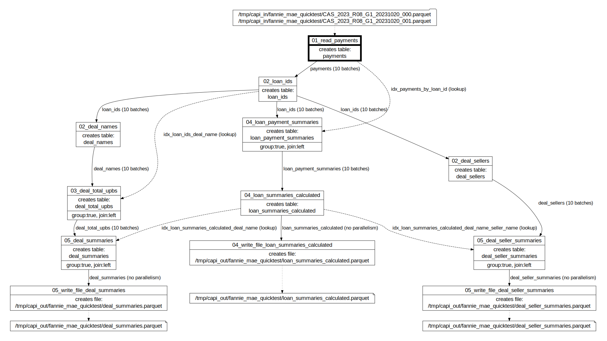

# Fannie Mae integration test

Created using Ubuntu WSL. Other Linux flavors and MacOS may require edits.

## fannie_mae_quicktest vs fannie_mae_bigtest

This test comes in two flavors. 

fannie_mae_quicktest has all data ready, it just has to be copied to /tmp/capi_*, and you can run the test. Root-level [copy_demo_data.sh](../../../copy_demo_data.sh) script does that, among other things.

fannie_mae_bigtest is a variation of this test that uses large number of payment records borrowed from capillaries-fanniemae repo (~0.5mil mortgages insured in 2023).

## Workflow

The [DOT diagram](../../../doc/glossary.md#dot-diagrams) generated with
```
go run capitoolbelt.go validate_script -script_file=../../../test/data/cfg/fannie_mae_quicktest/script.json -params_file=../../../test/data/cfg/fannie_mae_quicktest/script_params.json -idx_dag=true
```
and rendered in https://dreampuf.github.io/GraphvizOnline :



## What's tested:

- distinct_table node type
- file_table read from multiple files file
- table_file with top/limit/order
- py_calc calculations taking JSON as input and producing JSON
- table_lookup_table with parallelism, left outer grouped joins, string_agg() aggregate function

## How to test

See [integration tests](../../../doc/testing.md#integration-tests) section for generic instructions on how to run integration tests.