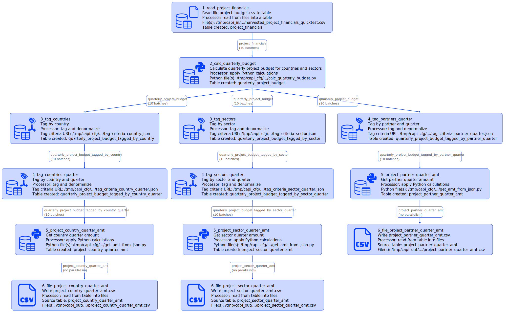

# Global Affairs Canada international assistance integration test

Created using Ubuntu WSL. Other Linux flavors and MacOS may require edits.

## global_affairs_quicktest vs global_affairs_bigtest

This test comes in two flavors:
- bigtest works with a full dataset obtained from Global Affairs in February 2025, contains 7769 "projects"
- quicktest uses only 19 "projects" 

See 2_one_run.sh to see how run the bigtest. It takes about 40 min to run on an average devbox.

## Workflow

The diagram generated with
```
go run capitoolbelt.go validate_script -script_file=../../../test/data/cfg/global_affairs_quicktest/script.json -params_file=../../../test/data/cfg/global_affairs_quicktest/script_params_quicktest.json -detail=idx
```


Full transcript of what the result of each script node looks like in Cassandra - [transcript_global_affairs.md](../../../doc/transcript_global_affairs.md).

## What's tested:

- [file_table](../../../doc/glossary.md#file_table) read from multiple files file
- [tag_and_denormalize](../../../doc/glossary.md#tag_and_denormalize-processor) custom processor: denormalizes products table by checking tag criteria and producing a new data row for each matching tag
- [table_file](../../../doc/glossary.md#table_file) with [top/limit/order](../../../doc/scriptconfig.md#wtop)
- [table_custom_tfm_table](../../../doc/glossary.md#table_custom_tfm_table) custom processor [py_calc](../../../doc/glossary.md#py_calc-processor) calculations taking JSON as input and producing JSON

## How to test

See [integration tests](../../../doc/testing.md#integration-tests) section for generic instructions on how to run integration tests.