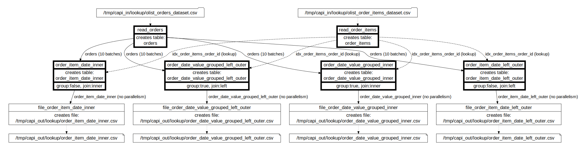

# Lookup integration test

Created using Ubuntu WSL. Other Linux flavors and MacOS may require edits.

## Workflow

The [DOT diagram](../../../doc/glossary.md#dot-diagrams) generated with
```
go run toolbelt.go validate_script -script_file=../../../test/data/cfg/lookup/script.json -params_file=../../../test/data/cfg/lookup/script_params_two_runs.json -idx_dag=true
```
and rendered in https://dreampuf.github.io/GraphvizOnline :



## What's tested:

- table_lookup_table with parallelism (10 batches), all suported types of joins (inner and left outer, grouped and not)
- file_table read from single file
- table_file with top/limit/order
- single-run (test_one_run.sh) and multi-run (test_two_runs.sh) script execution

Multi-run test simulates the scenario when an operator validates loaded order and order item data before proceeding with joining orders with order items.

## How to test

### Direct node execution

Run [test_exec_nodes.sh](test_exec_nodes.sh)  - the [Toolbelt](../../../doc/glossary.md#toolbelt) executes [script](script.json) [nodes](../../../doc/glossary.md#script-node) one by one, without invoking RabbitMQ workflow.

### Using RabbitMQ workflow (single run)

Make sure the [Daemon](../../../doc/glossary.md#daemon) is running (run `go run daemon.go` to start it in pkg/exe/daemon).

Run [test_one_run.sh](test_one_run.sh) - the [Toolbelt](../../../doc/glossary.md#toolbelt) publishes [batch messages](../../../doc/glossary.md#data-batch) to RabbitMQ and the [Daemon](../../../doc/glossary.md#daemon) consumes them and executes all [script](script.json) [nodes](../../../doc/glossary.md#script-node) in parallel as part of a single [run](../../../doc/glossary.md#run).

### Using RabbitMQ workflow (two runs)

Make sure the [Daemon](../../../doc/glossary.md#daemon) is running (run `go run daemon.go` to start it in pkg/exe/daemon).

Run [test_two_runs.sh](test_two_runs.sh) - the [Toolbelt](../../../doc/glossary.md#toolbelt) publishes [batch messages](../../../doc/glossary.md#data-batch) to RabbitMQ and the [Daemon](../../../doc/glossary.md#daemon) consumes them and executes [script](script.json) [nodes](../../../doc/glossary.md#script-node) that load data from files as part of the first [run](../../../doc/glossary.md#run).

After the first [run](../../../doc/glossary.md#run) is complete, the [Toolbelt](../../../doc/glossary.md#toolbelt) publishes [batch messages](../../../doc/glossary.md#data-batch) to RabbitMQ and the [Daemon](../../../doc/glossary.md#daemon) consumes them and executes [script](script.json) [nodes](../../../doc/glossary.md#script-node) that process the data as part of the second [run](../../../doc/glossary.md#run).

This test mimics the "operator validation" scenario.

## Possible edits

Play with number of total line items (see "-items=..." in [1_create_test_data.sh](1_create_test_data.sh)).
  
## References:

Data model design: Brazilian E-Commerce public dataset (https://www.kaggle.com/datasets/olistbr/brazilian-ecommerce)