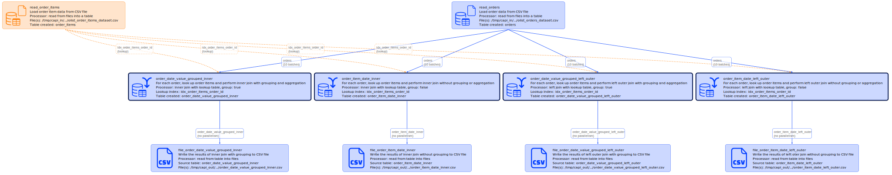

# Lookup integration test

Created using Ubuntu WSL. Other Linux flavors and MacOS may require edits.

## lookup_quicktest vs lookup_bigtest

This test comes in two flavors. 

portfolio_quicktest has all data ready, it just has to be copied to /tmp/capi_*, and you can run the test. Root-level [copy_demo_data.sh](../../../copy_demo_data.sh) script does that, among other things.

lookup_bigtest is a variation of this test that uses:
- large number of orders
- parquet files for input and output 
and requires test data to be generated - see [1_create_data.sh](./1_create_data.sh).

## Workflow

The diagram generated with
```
go run capitoolbelt.go validate_script -script_file=../../../test/data/cfg/lookup/script_quick.yaml -params_file=../../../test/data/cfg/lookup/script_params_quick_fs_multi.yaml -detail=idx
```



## What's tested:

- [table_lookup_table](../../../doc/glossary.md#table_lookup_table) with parallelism (10 batches), all suported types of joins (inner and left outer, grouped and not)
- [file_table](../../../doc/glossary.md#file_table) read from single file
- [table_file](../../../doc/glossary.md#table_file) with [top/limit/order](../../../doc/scriptconfig.md#wtop)
- single-run (test_one_run.sh) and multi-run (test_two_runs.sh) script execution

Multi-run test simulates the scenario when an operator validates loaded order and order item data before proceeding with joining orders with order items.

## How to test

See [integration tests](../../../doc/testing.md#integration-tests) section for generic instructions on how to run integration tests.

## Possible edits

Play with the number of total line items (see "-items=..." in [1_create_data.sh](./1_create_data.sh)).
  
## References:

Data model design: Brazilian E-Commerce public dataset `https://www.kaggle.com/datasets/olistbr/brazilian-ecommerce`