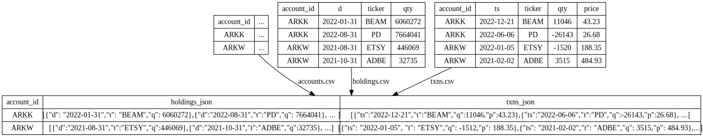

# Portfolio performance calculation integration test

Created using Ubuntu WSL. Other Linux flavors and MacOS may require edits.

## portfolio_quicktest vs portfolio_bigtest

This test comes in two flavors. 

portfolio_quicktest has all data ready, it just has to be copied to /tmp/capi_*, and you can run the test. Root-level [copy_demo_data.sh](../../../copy_demo_data.sh) script does that, among other things.

portfolio_bigtest is a variation of this test that uses:
- large number of accounts
- parquet files for input and output 
and requires test data to be generated - see [1_create_test.data.sh](./bigtest/1_create_data.sh).

## Workflow

The [DOT diagram](../../../doc/glossary.md#dot-diagrams) generated with
```
go run capitoolbelt.go validate_script -script_file=../../../test/data/cfg/portfolio_quicktest/script.json -params_file=../../../test/data/cfg/portfolio_quicktest/script_params.json -idx_dag=true
```
and rendered in https://dreampuf.github.io/GraphvizOnline :


Or, here is a bit more low-level walkthrough

### Data preparation

First few script nodes read CSV files and produce Cassandra records with JSON:



In other words, we have to collect all holdings/txn data for an account in a single record, so it can be processed by [py_calc](../../../doc/glossary.md#py_calc-processor).

### Calculation

For each account_id, [py_calc](../../../doc/glossary.md#py_calc-processor) node calc_account_period_perf takes both JSON fields and calculates annualized returns for the range specified by `period_start_eod` and `period_end_eod` script [parameters](../../../doc/scriptconfig.md#template-parameters).

After calculating portfolio returns, we end up with data looking as follows:

| account_id | perf_json |
| --- | --- |
| ARKK | {"2021": {"All": {"cagr": -0.2398, "twr": -0.2398}, "Communication Services": {"cagr": -0.3183, "twr": -0.3183}, "Consumer Cyclical": {"cagr": 0.1764, "twr": 0.1764}, ... } |
| ARKW | {"2021": {"All": {"cagr": -0.1949, "twr": -0.1949}, "Communication Services": {"cagr": -0.293, "twr": -0.293}, "Consumer Cyclical": {"cagr": -0.0385, "twr": -0.0385}, ... } |

### Reporting

Technicaly speaking, we already have what we want. Next few steps make this JSON data relational:

| ARK fund | Period | Sector | Time-weighted annualized return |
| --- |  --- | --- | --- |
| ARKK | 2021 | All | -23.98 |
| ARKK | 2021 |  Communication Services |  -31.83 |
| ARKK | 2021 |  Consumer Cyclical |  17.64 |
| ARKW | 2021 |  All |  -19.49 |
| ARKW | 2021 |  Communication Services |  -29.30 |
| ARKW | 2021 |  Consumer Cyclical |  -3.85 |

See results in /tmp/capi_out/portfolio_quicktest.

## What's tested:

- [file_table](../../../doc/glossary.md#file_table) read from file directly into JSON fields
- [table_lookup_table](../../../doc/glossary.md#table_lookup_table) with parallelism, left outer grouped joins, string_agg() aggregate function
- [py_calc](../../../doc/glossary.md#py_calc-processor) calculations taking JSON as input and producing JSON
- [table_file](../../../doc/glossary.md#table_file) with [top/order](../../../doc/scriptconfig.md#wtop) to produce ordered performance data matrix

## How to test

See [integration tests](../../../doc/testing.md#integration-tests) section for generic instructions on how to run integration tests.

## User-supplied formulas

There are files in `test/data/cfg/portfolio_quicktest/py` directory: some contains Python functions called by Capillaries [py_calc processor](../../../doc/glossary.md#py_calc-processor), other (with `_test` suffix) files are user-provided set of tests for those functions (yes, user-provided code can/should be tested too). 

## Possible edits

Stretch goal: change portfolio_calc.py and script.json (period tags) to produce montly, not quarterly returns for each account.

## How accurate are these numbers?

Not very. The data was borrowed from free projects that scrape ARK websites, there are a few problems with it:
- we do not have exact trade prices, we use EOD prices instead
- holding information for some funds and stocks has gaps, so we have to fill them by creating non-existing trades
- exact price information would take too much space in our test price provider, so we store only some key points and interpolate price for specific stock and date
- we do not know how close our TWR/CAGR calculation formula is to the method used in the official calculation of ARK funds performance

Given all that, the numbers returned by this test are relatively close to the official returns published by ARK, compare these two files to see the difference:
```
cd /mnt/capi_out/portfolio_quicktest
diff account_year_perf_official.csv account_year_perf_baseline.csv
```