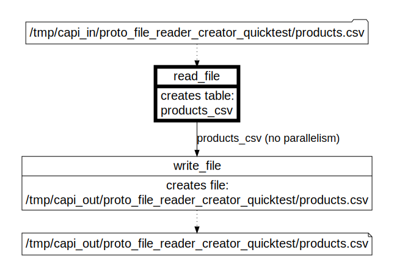

# proto_file_reader_creator integration test

Created using Ubuntu WSL. Other Linux flavors and MacOS may require edits.

## Workflow

There are no Capillaries scripts for this test in the Capillaries codebase. The scripts are generated on the fly by [1_generate_scripts.sh](./1_generate_scripts.sh) and saved to `/tmp/capi_cfg/proto_file_reader_creator_quicktest`.  After the scripts are generated, you can generate the  [DOT diagram](../../../doc/glossary.md#dot-diagrams) diagram using this command:

```
go run capitoolbelt.go validate_script -script_file=/tmp/capi_cfg/proto_file_reader_creator_quicktest/script_csv.json -idx_dag=true
```
and render it in https://dreampuf.github.io/GraphvizOnline :



## What's tested:

- toolbelt `proto_file_reader_creator` command
- file_table read from single file (csv and parquet) for all supported data types
- table_file write to single file (csv and parquet) for all supported data types
- single-run script execution

## How to test

See [integration tests](../../../doc/testing.md#integration-tests) section for generic instructions on how to run integration tests.
