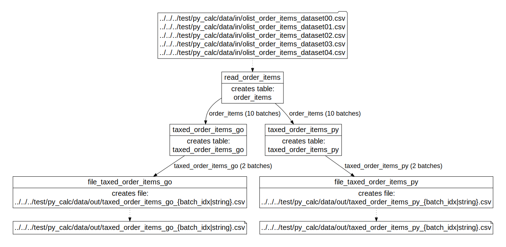

# py_calc integration test

Created using Ubuntu WSL. Other Linux flavors and MacOS may require edits.

env_config.json custom_processors.py_calc.python_interpreter_path setting assumes 'python' symbolic link points to Python3 interpreter (min Python 3.10)

User-supplied formulas are expected to reside in test/data/cfg/py_calc/py directory.

## Workflow

The [DOT diagram](../../../doc/glossary.md#dot-diagrams) generated with
```
go run toolbelt.go validate_script -script_file=../../../test/data/cfg/py_calc/script.json -params_file=../../../test/data/cfg/py_calc/script_params.json -idx_dag=true
```
and rendered in https://dreampuf.github.io/GraphvizOnline :



## What's tested:

- table_custom_tfm_table custom processor (py_calc) with writer using values from both reader (for example, r.shipping_limit_date) and custom processor (for example, p.taxed_value); please note: p.* datatype, like decimal2 of p.taxed_value, is used by writer only, do not expect this datatype when using this field in your Python code
- file_table reading from multiple files
- table_file with top/limit/order
- table_file using file-per-batch configuration (see {batch_idx} parameter)
- table_table processor that, using Capillaries Go funtions and arithmetic operations, implements a subset (no weekday math) of calculations provided by Python processor 

## How to test

### Direct node execution

Run [test_exec_nodes.sh](test_exec_nodes.sh) - the [Toolbelt](../../../doc/glossary.md#toolbelt) executes [script](script.json) [nodes](../../../doc/glossary.md#script-node) one by one, without invoking RabbitMQ workflow.

### Using RabbitMQ workflow

Make sure the [Daemon](../../../doc/glossary.md#daemon) is running (run `go run daemon.go` to start it in pkg/exe/daemon).

Run [test_one_run.sh](test_one_run.sh) - the [Toolbelt](../../../doc/glossary.md#toolbelt) publishes [batch messages](../../../doc/glossary.md#data-batch) to RabbitMQ and the [Daemon](../../../doc/glossary.md#daemon) consumes them and executes all [script](script.json) [nodes](../../../doc/glossary.md#script-node) in parallel as part of a single [run](../../../doc/glossary.md#run).

### Use dockerized daemon

py_calc integration test has everything ready to run against containerized [Daemon](../../../doc/glossary.md#daemon).

Make sure **you are not running the Daemon directly** (like `go run daemon.go`) on this test host. If you are running it, it will try to process script nodes using URLs pointing to shared volumes (see below), and will not be able to find them.

The script below runs full `py_calc` test expecting the Daemon in the container to process all script node. Please pay attention to the following details in the [docker-compose.yml](../../../docker-compose.yml), you may need to make some adjustments to the script.

| | |
|-|-|
| Shared volumes | The test mimics production enviroment with different volumes used for configuration, source and target data. It's important that each volume can be referenced by the same URL by the host (that runs the [Toolbelt](../../../doc/glossary.md#toolbelt)) and the container (that runs the Daemon). For simplicity, we will create a few top-level directories on the host machine (they will be mounted in the container when we run it). |
| IP addresses | At this point, you should already have Cassandra and RabbitMQ running in their containers. Get their IP addresses (for example, by running `hostname-i` in the container shell). The example below assumes that RabbitMQ and Cassandra containers are using default bridge network and have address 172.17.0.2 and 172.17.0.3, respectively (see [Getting started](../../../doc/started.md)). |

Consider running this script step by step to avoid obscure errors and to have a clear picture of what's going on.

```
echo 'Preparing shared volumes...'

sudo su
mkdir /capillaries_docker_test_cfg
mkdir /capillaries_docker_test_in
mkdir /capillaries_docker_test_out
chmod 777 /capillaries_docker_test_cfg
chmod 777 /capillaries_docker_test_in
chmod 777 /capillaries_docker_test_out
exit

./1_create_test_data.sh

echo 'Copying input data to shared volumes...'

cp -r ../../data/cfg/py_calc /capillaries_docker_test_cfg/
cp -r ../../data/in/py_calc /capillaries_docker_test_in/
cp -r ../../data/out/py_calc /capillaries_docker_test_out/

echo 'Starting Capillaries containers...'

docker compose -p "test-capillaries-containers" up -d

echo 'Wait for the container to start, check out stdout - the daemon should connect to the RabbitMQ sucessfully, expect something like "started consuming queue" in the stdout'

echo 'Starting runs, assuming dockerized daemon will pick it up - watch dockerized daemon stdout...'

./2_one_run_docker.sh

echo 'Watch dockerized daemon stdout, expect something like "run 1, status complete" in the end'

echo 'Copying results back to test/data/out/py_calc and analyzing them...'

cp -f /capillaries_docker_test_out/py_calc/* ../../data/out/py_calc 

./3_compare_results.sh

echo 'Stopping and removing container(s)...'

docker stop capillaries_daemon
docker rm capillaries_daemon

echo 'Cleaning test/data/in/py_calc and test/data/out/py_calc...'

./4_clean.sh

echo 'Deleting shared volumes...'

sudo su
rm -fR /capillaries_docker_test_cfg
rm -fR /capillaries_docker_test_in
rm -fR /capillaries_docker_test_out
exit
```

The user may be tempted to run tests against dockerized Capillaries daemon without even installing Go. This is possible in theory, but some component has to analyze the script file and post messages to RabbitMQ. This is exactly what [Toolbelt](../../../doc/glossary.md#toolbelt) `start_run` command does (see [API reference](../../../doc/api.md)). And you need Go to build the Toolbelt.

## Possible edits

- number of total line items (see "-items=..." in [1_create_test_data.sh](1_create_test_data.sh))
- number of input files (default is 5, see "split -d -nl/5..." in [1_create_test_data.sh](1_create_test_data.sh))

## User-supplied formulas

There are two files in `test/data/cfg/py_calc/py` directory: one contains Python functions called by Capillaries [py_calc processor](../../../doc/glossary.md#py_calc-processor), another file is a user-provided set of tests for those functions (yes, user-provided code can/should be tested too). 

## References:

Data model design: Brazilian E-Commerce public dataset (https://www.kaggle.com/datasets/olistbr/brazilian-ecommerce)