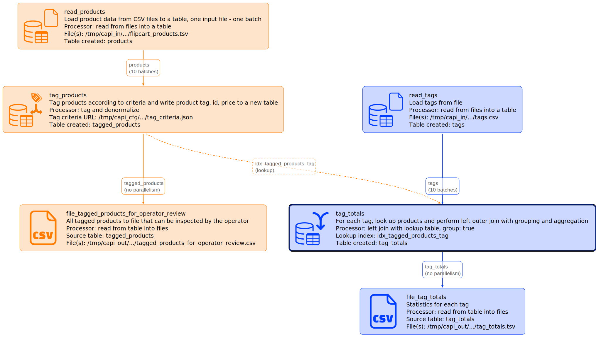

# tag_and_denormalize integration test

Created using Ubuntu WSL. Other Linux flavors and MacOS may require edits.

## Workflow

The diagram generated with
```
go run capitoolbelt.go validate_script -script_file=../../../test/data/cfg/tag_and_denormalize_quicktest/script.json -params_file=../../../test/data/cfg/tag_and_denormalize_quicktest/script_params_two_runs.json -detail=idx
```



## What's tested:

- [file_table](../../../doc/glossary.md#file_table) read from single file
- [tag_and_denormalize](../../../doc/glossary.md#tag_and_denormalize-processor) custom processor: denormalizes products table by checking tag criteria and producing a new data row for each matching tag
- [table_lookup_table](../../../doc/glossary.md#table_lookup_table) with parallelism (10 batches), left outer join with grouping
- [table_file](../../../doc/glossary.md#table_file)table_file with [top/limit/order](../../../doc/scriptconfig.md#wtop)
- single-run (test_one_run.sh) and multi-run (test_two_runs.sh) script execution

Multi-run test simulates the scenario when an operator validates tagged products (see /data/out/tagged_products_for_operator_review.csv) before proceeding with calculating totals.

## How to test

See [integration tests](../../../doc/testing.md#integration-tests) section for generic instructions on how to run integration tests.

## References:

Data model design: Flipkart E-commerce Dataset at https://www.kaggle.com