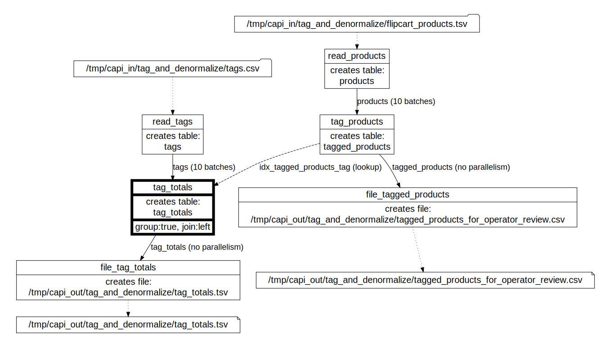

# tag_and_denormalize integration test

Created using Ubuntu WSL. Other Linux flavors and MacOS may require edits.

## Workflow

The [DOT diagram](../../../doc/glossary.md#dot-diagrams) generated with
```
go run toolbelt.go validate_script -script_file=../../../test/data/cfg/tag_and_denormalize/script.json -params_file=../../../test/data/cfg/tag_and_denormalize/script_params_two_runs.json -idx_dag=true
```
and rendered in https://dreampuf.github.io/GraphvizOnline :



## What's tested:

- file_table read from single file
- tag_and_denormalize custom processor: denormalizes products table by checking tag criteria and producing a new data row for each matching tag
- table_lookup_table with parallelism (10 batches), left outer join with grouping
- table_file with top/limit/order
- single-run (test_one_run.sh) and multi-run (test_two_runs.sh) script execution

Multi-run test simulates the scenario when an operator validates tagged products (see /data/out/tagged_products_for_operator_review.csv) before proceeding with calculating totals.

## How to test

### Direct node execution

Run [test_exec_nodes.sh](test_exec_nodes.sh)  - the [Toolbelt](../../../doc/glossary.md#toolbelt) executes [script](../../data/cfg/tag_and_denormalize/script.json) [nodes](../../../doc/glossary.md#script-node) one by one, without invoking RabbitMQ workflow.

### Using RabbitMQ workflow (single run)

Make sure the [Daemon](../../../doc/glossary.md#daemon) is running (run `go run daemon.go` to start it in pkg/exe/daemon).

Run [test_one_run.sh](test_one_run.sh) - the [Toolbelt](../../../doc/glossary.md#toolbelt) publishes [batch messages](../../../doc/glossary.md#data-batch) to RabbitMQ and the [Daemon](../../../doc/glossary.md#daemon) consumes them and executes all [script](../../data/cfg/tag_and_denormalize/script.json) [nodes](../../../doc/glossary.md#script-node) in parallel as part of a single [run](../../../doc/glossary.md#run).

### Using RabbitMQ workflow (two runs)

Make sure the [Daemon](../../../doc/glossary.md#daemon) is running (run `go run daemon.go` to start it in pkg/exe/daemon).

Run [test_two_runs.sh](test_two_runs.sh) - the [Toolbelt](../../../doc/glossary.md#toolbelt) publishes [batch messages](../../../doc/glossary.md#data-batch) to RabbitMQ and the [Daemon](../../../doc/glossary.md#daemon) consumes them and executes [script](../../data/cfg/tag_and_denormalize/script.json) [nodes](../../../doc/glossary.md#script-node) that:
- load data from files
- create a denormalized tag/product table

as part of the first [run](../../../doc/glossary.md#run).

After the first [run](../../../doc/glossary.md#run) is complete, the [Toolbelt](../../../doc/glossary.md#toolbelt) publishes [batch messages](../../../doc/glossary.md#data-batch) to RabbitMQ and the [Daemon](../../../doc/glossary.md#daemon) consumes them and executes [script](../../data/cfg/tag_and_denormalize/script.json) [nodes](../../../doc/glossary.md#script-node) that process the totals as part of the second [run](../../../doc/glossary.md#run).

This test mimics the "operator validation" scenario.

### Using RabbitMQ workflow (single run, HTTPS inputs)

Make sure the [Daemon](../../../doc/glossary.md#daemon) is running (run `go run daemon.go` to start it in pkg/exe/daemon).

Same as `test_one_run.sh`, but uses GitHub as the source of configuration and input data.

Run [test_one_run_input_https.sh](test_one_run_input_https.sh) - the [Toolbelt](../../../doc/glossary.md#toolbelt) publishes [batch messages](../../../doc/glossary.md#data-batch) to RabbitMQ and the [Daemon](../../../doc/glossary.md#daemon) consumes them and executes all [script](../../data/cfg/tag_and_denormalize/script.json) [nodes](../../../doc/glossary.md#script-node) in parallel as part of a single [run](../../../doc/glossary.md#run).

## References:

Data model design: Flipkart products public dataset (https://www.kaggle.com/datasets/atharvjairath/flipkart-ecommerce-dataset)