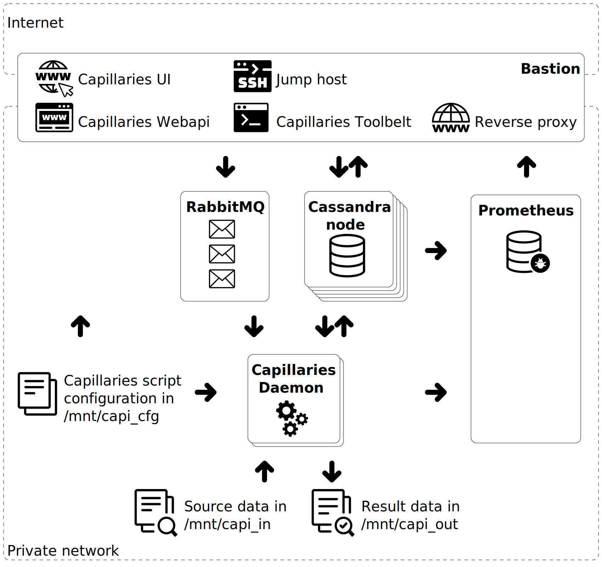

# Working with Capillaries deploy tool

Capillaries [Deploy tool](../../doc/glossary.md#deploy-tool) can provision complete Capillaries cloud environment in public/private clouds that support [Openstack API](https://www.openstack.org).

`test/deploy` directory contains two sample projects (capideploy_project_dreamhost.json and capideploy_project_genesis.json) used by [Deploy tool](../../doc/glossary.md#deploy-tool). Sensitive and repetitive configuration can be stored in project parameter files (capideploy_project_params_dreamhost.json and capideploy_project_params_genesis.json), and it's a good idea to store parameter files at somewhat secure location (like user home dir).

For troubleshooting, add `-verbose` argument to your deploy tool command line.

## The goal

On the diagram below, each rectangle represents a VPS instance that performs some specific task. Please note there are multiple Cassandra node instances (we need a Cassadra cluster) and multiple instances running Capillaries Daemon (this is how Capillaries scales out). Prometheus and RabbitMQ are not bottlenecks, so one instance for each is enough. Bastion instance is the gateway to the private network where the deployment is hosted, it:
- runs a reverse proxy so users can access Prometheus and RabbitMQ web consoles
- runs Capillaries Webapi and UI so users can start Capillaries runs and see their execution status
- has Capillaries Toolbelt installed so SSH users an start runs from the command line
- works as a jump host so users have SSH access to other instances in the private network
- accumulates Capillaries Daemon logs in /var/log/capillaries using rsyslog

Capillaries configuration scripts and in/out data are stored on separate volumes. In current test implementation, Bastion instances mounts them as /mnt/capi_cfg,/mnt/capi_in, /mnt/capi_out and gives Capillaries Daemons SFTP access to them. Alternatively, if cloud provider supports multi-attach volumes, Daemon instances can mount all three volumes directly, so there will be no need for SFTP file access. 



## Openstack environment

1. Make sure you have an Openstack project ready, with all `OS_*` variables defined in the project parameter file. Usually, Openstack cloud provider generates a shell script that sets all those variables for you. Just manually copy those values to the parameter file, one by one.
2. Make sure you have created the key pair for SSH access to the Openstack instances, key pair name stored in `root_key_name` in the project file. Through this document, we will be assuming the key pair is stored in `~/.ssh/` and the private key file this kind of name:  `sampledeploymentXXX_rsa`.
3. Make sure all configuration values in the project parameters file are up-to-date. Some paramaters, like `sftp_user_private_key` may contain multi-line content - make sure you replace all line endings with `\n`.
4. Reserve a floating IP address with your Openstack provider, this address will be assigned to the `bastion` instance and will be your gateway to all of your instances. You can do that either in Openstack UI or by running this command:
```
openstack floating ip create <external network name, for example, ext-net>
```
After reserving the IP address, make sure you:
- update `floating_ip_address` parameter in your capideploy parameter JSON file
- reference it in the commands using BASTION_IP environment variable (see below)
- provide a jumphost configuration for this IP address (see below), Cassandra cluster setup will need it
When you think you do not need the floating IP address anymore, run:
```
openstack floating ip delete $BASTION_IP
```

To use bastion instance as an SSH jumphost, make sure you have set up this IP address for a jump host in `~/.ssh/config` file:

```
Host <dreamhost_bastion_ip>
  User ubuntu
  StrictHostKeyChecking=no
  UserKnownHostsFile=/dev/null
  IdentityFile ~/.ssh/sampledeployment001_rsa
Host <genesis_bastion_ip>
  User ubuntu
  StrictHostKeyChecking=no
  UserKnownHostsFile=/dev/null
  IdentityFile ~/.ssh/sampledeployment002_rsa
```

## Set environment variables

Just for convenience, let's store deploy tool arguments and other configuration settings in shell variables, for example:
```
export capideploy=../../build/capideploy.exe
export DEPLOY_ARGS="-prj capideploy_project_genesis.json -prj_params $HOME/capideploy_project_params_genesis.json"
export DEPLOY_ROOT_KEY=$HOME/.ssh/sampledeployment002_rsa
export BASTION_IP=<floating_ip_reserved_above>
```

## Build Capillaries components

Build deploy tool to run on your dev/devops machine (this is a WSL example):

```
cd ./test/deploy
go build -o ../../build/capideploy.exe -ldflags="-s -w" ../../pkg/exe/deploy/capideploy.go
chmod 755 ../../build/capideploy.exe
```

Build binaries for the cloud (Linux):

```
cd ./test/deploy
GOOS=linux GOARCH=amd64 go build -o ../../build/linux/amd64/capidaemon -ldflags="-s -w" ../../pkg/exe/daemon/capidaemon.go
gzip -f ../../build/linux/amd64/capidaemon
GOOS=linux GOARCH=amd64 go build -o ../../build/linux/amd64/capiwebapi -ldflags="-s -w" ../../pkg/exe/webapi/capiwebapi.go
gzip -f ../../build/linux/amd64/capiwebapi
GOOS=linux GOARCH=amd64 go build -o ../../build/linux/amd64/capitoolbelt -ldflags="-s -w" ../../pkg/exe/toolbelt/capitoolbelt.go
gzip -f ../../build/linux/amd64/capitoolbelt
GOOS=linux GOARCH=amd64 go build -o ../../build/linux/amd64/capiparquet -ldflags="-s -w" ../code/parquet/capiparquet.go
gzip -f ../../build/linux/amd64/capiparquet
```

Build [Capillaries UI](../../doc/glossary.md#capillaries-ui):

```
cd ./ui
export CAPILLARIES_WEBAPI_URL=http://$BASTION_IP:6543
npm run build
```

## Openstack networking and volumes

This step does not have to be performed often, assuming the Openstack provider does not charge for networking and volumes.

The following commands will perform Openstack networking/volume setup according to your Capideploy project settings:
```
cd ./test/deploy
$capideploy create_security_groups $DEPLOY_ARGS
$capideploy create_networking $DEPLOY_ARGS
$capideploy create_volumes $DEPLOY_ARGS
```

## Prepare test data

This command will populate /tmp/capi_in, /tmp/capi_cfg, /tmp/capi_out

```
cd ./test/code/lookup/quicktest
./1_create_data.sh
cd ../bigtest
./1_create_data.sh
cd ../../py_calc
./1_create_quicktest_data.sh
cd ../tag_and_denormalize
./1_create_quicktest_data.sh
cd ../../..
```

Deployment projects are configured to tell deploy tool to pick up the files to upload from those locations.

## Build test environment 

```
# Create all instances in one shot
$capideploy create_instances all $DEPLOY_ARGS

# Make sure we can actually login to each instance. If an instance is missing for too long, go to the provider console/logs for details
$capideploy ping_instances all $DEPLOY_ARGS

# Install all pre-requisite software
$capideploy install_services all $DEPLOY_ARGS

# 1. Create sftp user (we assume that Openstack provider does not support multi-attach volumes, so we have to use sftp to read and write data files)
# 2. Allow these instances to connect to data via sftp
#$capideploy create_instance_users bastion $DEPLOY_ARGS
#$capideploy copy_private_keys bastion,daemon01,daemon02,daemon03,daemon04 $DEPLOY_ARGS

# Attach bastion and Cassandra volumes (data and maybe commitlog), make ssh_user (or sftp_user, if you use sftp instead of nfs) owner
$capideploy attach_volumes bastion,cass01,cass02,cass03,cass04,cass05,cass06,cass07,cass08 $DEPLOY_ARGS

# Now it's a good time to start Cassandra cluster in a separate shell session (see next section)

# Upload binaries and their configs in one shot. Make sure you have all binaries and test data built before uploading them (see above).
$capideploy upload_files up_daemon_binary,up_daemon_env_config,up_webapi_env_config,up_webapi_binary,up_ui,up_toolbelt_env_config,up_toolbelt_binary,up_capiparquet_binary,up_diff_scripts $DEPLOY_ARGS

# Upload test files in one shot
$capideploy upload_files up_all_cfg,up_lookup_bigtest_in,up_lookup_bigtest_out,up_lookup_quicktest_in,up_lookup_quicktest_out $DEPLOY_ARGS

# If you want to run these tests, upload corresponding data files
$capideploy upload_files up_tag_and_denormalize_quicktest_in,up_tag_and_denormalize_quicktest_out,up_py_calc_quicktest_in,up_py_calc_quicktest_out,up_portfolio_quicktest_in $DEPLOY_ARGS

# Configure all services except Cassandra (which requires extra care), bastion first (it configs NFS)
$capideploy config_services bastion $DEPLOY_ARGS
$capideploy config_services rabbitmq,prometheus,daemon01,daemon02,daemon03,daemon04 $DEPLOY_ARGS
```

## Starting cassandra cluster

This is probably the most fragile part of the provisioning process, as Cassandra nodes, if started simultaneously, may get into token collision situation. To avoid it, you can either pre-configure nodes to avoid/reduce bootstrapping (this is beyond the scope of this README), or add nodes to Cassandra cluster one by one as described below.

The script below calls `config_service` deploy command for each Cassandra node and waits until `nodetool status` confirms that the node joined the cluster. It's worth running this script in a separate shell session right after `install_services` command is complete.

Keep in mind that `config_service` command also restarts Cassandra on each node.

```
#! /bin/bash

echo Stopping all nodes in the cluster...
$capideploy stop_services cass01,cass02,cass03,cass04,cass05,cass06,cass07,cass08 $DEPLOY_ARGS

cassNodes=('cass01:10.5.0.11' 'cass02:10.5.0.12' 'cass03:10.5.0.13' 'cass04:10.5.0.14' 'cass05:10.5.0.15' 'cass06:10.5.0.16' 'cass07:10.5.0.17' 'cass08:10.5.0.18')
for cassNode in ${cassNodes[@]}
do
  cassNodeParts=(${cassNode//:/ })
  cassNodeNickname=${cassNodeParts[0]}
  cassNodeIp=${cassNodeParts[1]}
  echo Configuring $cassNodeNickname $cassNodeIp...
  $capideploy config_services $cassNodeNickname $DEPLOY_ARGS
  if [ "$?" -ne "0" ]; then
    echo Cannot configure Cassandra on $cassNodeNickname
    return $?
  fi
  while :
  do
    nodetoolOutput=$(ssh -o StrictHostKeyChecking=no -i $DEPLOY_ROOT_KEY -J $BASTION_IP ubuntu@$cassNodeIp 'nodetool status' 2>&1)
    if [[ "$nodetoolOutput" == *"UJ  $cassNodeIp"* ]]; then
      echo $cassNodeNickname is joining the cluster, almost there...
    elif [[ "$nodetoolOutput" == *"InstanceNotFoundException"* ]]; then
      echo $cassNodeNickname is not started yet, getting instance not found exception
    elif [[ "$nodetoolOutput" == *"nodetool: Failed to connect"* ]]; then 
      echo $cassNodeNickname is not online, nodetool cannot connect to 7199 
    elif [[ "$nodetoolOutput" == *"Has this node finished starting up"* ]]; then 
      echo $cassNodeNickname is not online, still starting up 
    elif [[ "$nodetoolOutput" == *"UN  $cassNodeIp"* ]]; then
      echo $cassNodeNickname joined the cluster
      break
    elif [[ "$nodetoolOutput" == *"Normal/Leaving/Joining/Moving"* ]]; then
      echo $cassNodeNickname is about to start joining the cluster, nodetool functioning
    else
      echo $nodetoolOutput
    fi
    sleep 10
  done
done
ssh -o StrictHostKeyChecking=no -i $DEPLOY_ROOT_KEY -J $BASTION_IP ubuntu@10.5.0.11 'nodetool status'
```

## Monitoring test environment

RabbitMQ console (use RabbitMQ username/password from the project parameter file): `http://$BASTION_IP:15672`

Resource usage:

| Metric | Prometheus screen |
|- | - |
| CPU usage % | `http://$BASTION_IP:9090/graph?g0.expr=(1%20-%20avg(irate(node_cpu_seconds_total%7Bmode%3D%22idle%22%7D%5B10m%5D))%20by%20(instance))%20*%20100&g0.tab=0&g0.stacked=0&g0.show_exemplars=0&g0.range_input=15m` |
| RAM usage % | `http://$BASTION_IP:9090/graph?g0.expr=100%20*%20(1%20-%20((avg_over_time(node_memory_MemFree_bytes%5B10m%5D)%20%2B%20avg_over_time(node_memory_Cached_bytes%5B10m%5D)%20%2B%20avg_over_time(node_memory_Buffers_bytes%5B10m%5D))%20%2F%20avg_over_time(node_memory_MemTotal_bytes%5B10m%5D)))&g0.tab=0&g0.stacked=0&g0.show_exemplars=0&g0.range_input=15m` |
| Disk usage % | `http://$BASTION_IP:9090/graph?g0.expr=100%20-%20((node_filesystem_avail_bytes%7Bmountpoint%3D%22%2F%22%2Cfstype!%3D%22rootfs%22%7D%20*%20100)%2Fnode_filesystem_size_bytes%7Bmountpoint%3D%22%2F%22%2Cfstype!%3D%22rootfs%22%7D)&g0.tab=0&g0.stacked=0&g0.show_exemplars=0&g0.range_input=15m` |

Consolidated [Daemon](../../doc/glossary.md#daemon) log from all Daemon instances:

```
ssh -o StrictHostKeyChecking=no -i $DEPLOY_ROOT_KEY ubuntu@$BASTION_IP
less /var/log/capidaemon/capidaemon.log
```

## Run test processes

Start runs either using [Webapi](../../doc/glossary.md#webapi) at `http://$BASTION_IP` or using [Toolbelt](../../doc/glossary.md#toolbelt) via SSH.

### lookup_quicktest

| Field | Value |
|- | - |
| Keyspace | lookup_quicktest |
| Script URI | sftp://sftpuser@10.5.0.10/mnt/capi_cfg/lookup_quicktest/script.json |
| Script parameters URI | sftp://sftpuser@10.5.0.10/mnt/capi_cfg/lookup_quicktest/script_params_one_run.json |
| Start nodes |	read_orders,read_order_items |

or

```
ssh -o StrictHostKeyChecking=no -i $DEPLOY_ROOT_KEY ubuntu@$BASTION_IP '~/bin/capitoolbelt start_run -script_file=sftp://sftpuser@10.5.0.10/mnt/capi_cfg/lookup_quicktest/script.json -params_file=sftp://sftpuser@10.5.0.10/mnt/capi_cfg/lookup_quicktest/script_params_one_run.json -keyspace=lookup_quicktest -start_nodes=read_orders,read_order_items'
```

### lookup_bigtest

| Field | Value |
|- | - |
| Keyspace | lookup_bigtest |
| Script URI | sftp://sftpuser@10.5.0.10/mnt/capi_cfg/lookup_bigtest/script_parquet.json |
| Script parameters URI | sftp://sftpuser@10.5.0.10/mnt/capi_cfg/lookup_bigtest/script_params_one_run.json |
| Start nodes |	read_orders,read_order_items |

or

```
ssh -o StrictHostKeyChecking=no -i $DEPLOY_ROOT_KEY ubuntu@$BASTION_IP '~/bin/capitoolbelt start_run -script_file=sftp://sftpuser@10.5.0.10/mnt/capi_cfg/lookup_bigtest/script_parquet.json -params_file=sftp://sftpuser@10.5.0.10/mnt/capi_cfg/lookup_bigtest/script_params_one_run.json -keyspace=lookup_bigtest -start_nodes=read_orders,read_order_items'
```

or

```
ssh -o StrictHostKeyChecking=no -i $DEPLOY_ROOT_KEY ubuntu@$BASTION_IP '~/bin/capitoolbelt start_run -script_file=/mnt/capi_cfg/lookup_bigtest/script_parquet.json -params_file=/mnt/capi_cfg/lookup_bigtest/script_params_one_run.json -keyspace=lookup_bigtest -start_nodes=read_orders,read_order_items'
```

### py_calc_quicktest

| Field | Value |
|- | - |
| Keyspace | py_calc_bigtest |
| Script URI | sftp://sftpuser@10.5.0.10/mnt/capi_cfg/py_calc_bigtest/script.json |
| Script parameters URI | sftp://sftpuser@10.5.0.10/mnt/capi_cfg/py_calc_bigtest/script_params.json |
| Start nodes |	read_order_items |

or

```
ssh -o StrictHostKeyChecking=no -i $DEPLOY_ROOT_KEY ubuntu@$BASTION_IP '~/bin/capitoolbelt start_run -script_file=sftp://sftpuser@10.5.0.10/mnt/capi_cfg/py_calc_quicktest/script.json -params_file=sftp://sftpuser@10.5.0.10/mnt/capi_cfg/py_calc_quicktest/script_params.json -keyspace=py_calc_quicktest -start_nodes=read_order_items'
```

### tag_and_denormalize_quicktest

| Field | Value |
|- | - |
| Keyspace | tag_and_denormalize_quicktest |
| Script URI | sftp://sftpuser@10.5.0.10/mnt/capi_cfg/tag_and_denormalize_quicktest/script.json |
| Script parameters URI | sftp://sftpuser@10.5.0.10/mnt/capi_cfg/tag_and_denormalize_quicktest/script_params_one_run.json |
| Start nodes |	read_tags,read_products |

or

```
ssh -o StrictHostKeyChecking=no -i $DEPLOY_ROOT_KEY ubuntu@$BASTION_IP '~/bin/capitoolbelt start_run -script_file=sftp://sftpuser@10.5.0.10/mnt/capi_cfg/tag_and_denormalize_quicktest/script.json -params_file=sftp://sftpuser@10.5.0.10/mnt/capi_cfg/tag_and_denormalize_quicktest/script_params_one_run.json -keyspace=tag_and_denormalize_quicktest -start_nodes=read_tags,read_products'
```

## Results

Download all results from capi_out:

```
$capideploy download_files down_capi_out $DEPLOY_ARGS
```

Download consolidated Daemon log:

```
$capideploy download_files down_capi_logs $DEPLOY_ARGS
```

## Clear test environment

```
# Shut down instances to save money
$capideploy delete_instances all $DEPLOY_ARGS

# Delete everything (does not have to be performed often)
$capideploy delete_volumes $DEPLOY_ARGS
$capideploy delete_networking $DEPLOY_ARGS
$capideploy delete_security_groups $DEPLOY_ARGS
```

## Q&A

### Wordy configuration

Q. Why does project file contain repetitive configuration for each instance? Why not using templates?

A. When deploying to the cloud, deploy tool writes the current status of each cloud resource (instance, volume etc) to the project file. So, project file is not just a recipe, it's also a snapshot of the cloud deployment status. It can go out of sync, in which case a user should be able to easily tweak it (usually, make the id of a deleted resource empty). If you need a more concise configuration structure, consider developing a templating mechanism that would take a recipe and produce a Capillaries deploy project JSON file.

### Openstack environment variables

Q. The list of `OS_*` variables changes from one Openstack provider to another. Why?

A. The choice of Openstack variables required for authentication is up to the provider. Some providers may require more variables than other.

### Service: install vs. config

Q. Why having separate sets of commands for software installation and configuration?

A. Installing all Capillaries pre-requisites is a one-time job and can take a while. Configuring services is a job that:
- usually takes less less time to execute 
- can be executed multiple times per instance (like re-configuring Daemon thread parameters)
- may be required to be executed in some specific order (like adding nodes to Cassandra cluster)

### SFTP vs. multi-attach volumes

Q. Why these sample deployment projects use SFTP to read/write test data? Is there a more straightforward way?

A. Volume capabilities differ from one provider to another. Some providers simply do not support multi-attach volumes, while SFTP is something that can be configured in any cloud. If your provider supports multi-attach volumes, feel free to change all file URIs used in your project from SFTP scheme to, say, `/mnt/capi_*`, so Webapi/Toolbelt/Daemon read/write directly from/to your volume.

### Non-Openstack clouds

Q. Does Deploy tool work with clouds that do not support Openstack? AWS,Azure,GCP?

A. At the moment, no.

### Why should I use another custom deploy tool?

Q. I am familiar with widely used infrastructure provisioning tools (Ansible, Saltstack etc). Can I use them to deploy Capillaries components instead of using Capillaries Deploy tool?

A. Absolutely. Capillaries Deploy tool was created to serve only one goal: to demonstrate that production-scale Capillaries deployment can be provisioned very quickly (within a few minutes) without using complex third-party software.
